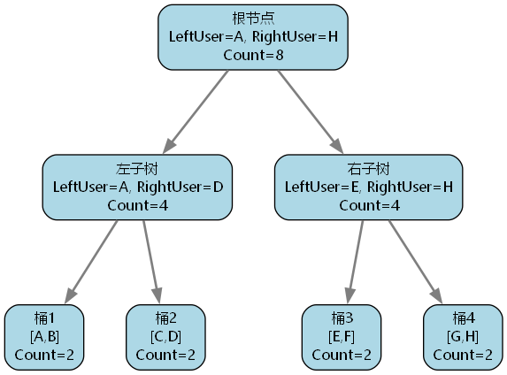
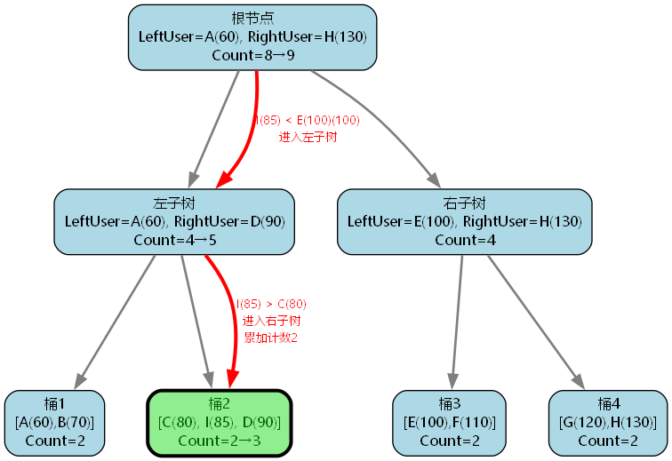
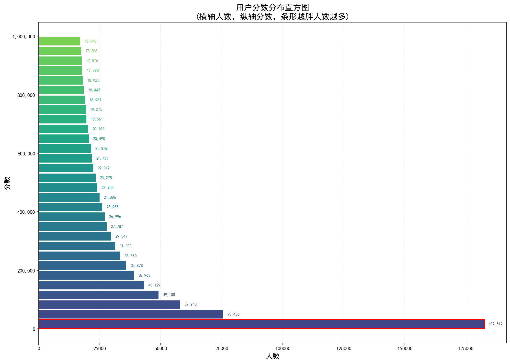

[TOC]

# 百万级游戏排行榜设计

# 一、概述

## 1.1 背景介绍

在游戏和社交应用中，排行榜是一个核心功能模块，广泛应用于全服战力榜、竞技场积分榜、好友排行榜等场景。一个高性能的排行榜系统需要支持以下核心操作：

- **添加玩家**：新玩家进入排行榜
- **更新分数**：玩家分数变化后重新排名
- **查询排名**：获取某个玩家的当前排名
- **获取前N名**：展示排行榜前列玩家
- **获取周围玩家**：展示目标玩家附近的排名情况

这些操作需要在**高并发**环境下提供**实时响应**，能够承载**数百万玩家**在线、**每秒百万级请求**的访问压力。

## 1.2 问题分析与方案对比

在设计排行榜系统之前，我们先分析六种常见方案的优缺点：

| 方案类型 | 核心设计 | 时间复杂度 | 优点 | 缺点 |
|---------|---------|-----------|------|------|
| **有序数组** | 按分数排序，二分查找 | 插入/删除：O(n)<br>查询排名：O(log n) |  内存连续，缓存友好<br> 范围查询高效<br> 实现简单 |  插入/删除需移动大量元素<br> 不适合百万级用户场景 |
| **分桶** | 分数范围分桶，桶存数组 | 插入/更新：O(M + log K + K)<br>查询排名：O(M + log K) |  保持内存连续性<br> 降低单桶操作复杂度 |  分裂桶时需移动大量引用<br> 桶数增加导致查询变慢 |
| **分桶 + 链表** | 分数范围分桶，桶存链表 | 插入/更新：O(M + log K + K)<br>查询排名：O(M + log K) |  分裂和删除桶无需移动大量引用<br> 保持分桶优势 |  内存局部性差<br> CPU缓存不友好 |
| **分桶 + 跳表** | 跳表管理桶，桶内有序数组 | 插入/更新：O(log M + log K + K)<br>查询排名：O(log M + log K) |  桶定位O(log M)<br> 实现相对简单 |  节点分散，缓存命中率低 |
| **纯红黑树** | 红黑树直接管理所有用户 | 插入/更新：O(log N)<br>查询排名：O(log N) |  自动平衡，稳定性能<br> 支持范围查询 |  内存局部性差<br> 范围操作效率低 |
| **分桶 + 红黑树** | 红黑树管理桶，桶内有序数组 | 插入/更新：O(log M + log K + K)<br>查询排名：O(log M + log K) |  保持分桶优势<br> 桶定位O(log M)<br> 内存局部性好 |  插入/更新后可能需要平衡调整 |

> **注**：M为桶数量，K为桶大小，N为用户总数

在方案选型过程中，最具争议的是分桶 + 跳表和分桶 + 红黑树。虽然分桶 + 红黑树在插入/更新操作后有概率需要调整树平衡，且节点对比次数略高于分桶 + 跳表，但由于红黑树节点较小且内存分布更为集中，反而更容易命中CPU缓存，减少了内存访问延迟。从实际性能测试结果来看，分桶 + 红黑树方案在各种场景下的综合耗时更短，表现更为稳定。具体性能对比分析详见第4章。

## 1.3 核心数据结构设计

本文着重介绍 **分桶 + 跳表** 和 **分桶 + 红黑树** 这两种方案。

### 1.3.1 核心设计思想

1. **分桶策略**：
   - 将所有玩家按分数范围划分为多个桶，每个桶内部存储少量有序玩家
   - 插入、删除和查询操作在单桶内进行
   - **优势**：
     - 桶内使用有序数组，内存连续，缓存友好
     - 批量操作利用 `Array.Copy` 的SIMD指令优化，性能提升数倍
     - 桶内操作时间复杂度控制在O(log K + K)（K为桶大小）

2. **红黑树管理**：
   - 用红黑树作为桶的全局管理结构
   - 非叶子节点存储区间信息，叶子节点关联具体桶
   - **优势**：
     - 桶定位时间复杂度稳定在O(log M)（M为桶数量）
     - 自动平衡机制保证树高度稳定
     - 支持利用节点计数快速计算排名

3. **跳表管理**：
   - 用跳表作为桶的全局管理结构
   - 每个节点包含桶和多层索引结构，每层包含指向下一节点的指针和间隔数
   - **优势**：
     - 桶定位时间复杂度为O(log M)
     - 实现相对简单，无需复杂的平衡操作
     - 支持利用间隔计数快速计算排名

### 1.3.2 性能优势

两种方案都能提供优异的性能表现，核心操作的时间复杂度如下：

| 操作 | 时间复杂度 |
|-----|-----------|
| 添加用户 | O(log M + log K + K) |
| 更新用户 | O(log M + log K + K) |
| 获取排名 | O(log M + log K) |
| 获取前N名 | O(log M + N) |
| 获取周围玩家 | O(log M + log K + N) |

> **注**：M为桶数量，K为桶大小，N为用户总数

这种设计通过分桶将大规模数据分解为可高效管理的小批量数据，结合红黑树或跳表的有序性和动态调整能力，在保证时间效率的同时优化了空间利用，实现了百万级用户场景下的高性能排行榜系统。


# 二、基础数据结构设计

## 2.1 排行榜接口设计

```csharp
public interface IRankingList
{
    /// <summary>
    /// 添加玩家到排行榜
    /// </summary>
    /// <param name="user">要添加的玩家</param>
    /// <returns>玩家的排名（从0开始）</returns>
    int AddUser(User user);

    /// <summary>
    /// 更新玩家分数（先删除旧数据，再插入新数据）
    /// </summary>
    /// <param name="user">包含新分数的玩家信息</param>
    /// <returns>玩家的新排名</returns>
    int UpdateUser(User user);

    /// <summary>
    /// 获取玩家的当前排名
    /// </summary>
    /// <param name="userId">玩家ID</param>
    /// <returns>玩家排名（从0开始）</returns>
    int GetUserRank(int userId);

    /// <summary>
    /// 获取排行榜前N名玩家
    /// </summary>
    /// <param name="topN">要获取的玩家数量</param>
    /// <returns>按排名排序的玩家数组</returns>
    User[] GetTopN(int topN);

    /// <summary>
    /// 获取目标玩家周围的排名
    /// </summary>
    /// <param name="userId">目标玩家ID</param>
    /// <param name="aroundN">左右各获取的玩家数量</param>
    /// <returns>玩家数组和目标玩家的排名</returns>
    (User[], int) GetAroundUser(int userId, int aroundN);

    /// <summary>
    /// 获取排行榜中的玩家总数
    /// </summary>
    /// <returns>玩家数量</returns>
    int GetRankingCount();
}
```

## 2.2 用户数据结构

用户数据结构包含玩家的唯一标识符（Id）、分数（Score）和最后更新时间（LastUpdateTime）。用户数据结构实现了 `IComparable<User>` 接口，用于在排行榜中进行排序。

**排序规则**

1. 首先根据分数降序排序
2. 如果分数相同，则根据最后更新时间升序排序
3. 如果最后更新时间也相同，则根据玩家ID升序排序

**代码实现**

```csharp
/// <summary>
/// 用户数据结构，表示排行榜中的一个玩家
/// 采用结构体（struct）而非类（class），避免频繁的堆内存分配
/// </summary>
public readonly struct User : IComparable<User>
{
    /// <summary>
    /// 玩家的唯一标识符
    /// </summary>
    public readonly int Id;

    /// <summary>
    /// 玩家的分数
    /// </summary>
    public readonly int Score;

    /// <summary>
    /// 最后更新时间
    /// </summary>
    public readonly DateTime LastUpdateTime;

    public User(int id, int score, DateTime lastUpdateTime)
    {
        Id = id;
        Score = score;
        LastUpdateTime = lastUpdateTime;
    }

    /// <summary>
    /// 比较方法，实现 IComparable 接口
    /// 排序规则：分数降序 → 更新时间升序 → ID升序
    /// </summary>
    public int CompareTo(User other)
    {
        int compareResult = -Score.CompareTo(other.Score);
        if (compareResult != 0) 
            return compareResult;
        compareResult = LastUpdateTime.CompareTo(other.LastUpdateTime);
        if (compareResult != 0) 
            return compareResult;
        return Id.CompareTo(other.Id);
    }
}
```

用户数据结构采用结构体（struct）而非类（class），从而避免频繁的堆内存分配。结构体数组在内存中连续存储，提高缓存命中率；玩家信息不会改变，使用值类型更安全。

## 2.3 用户桶

用户桶是排行榜的核心数据结构之一，负责存储和管理一组连续排名的玩家。每个桶内部采用有序数组存储玩家，充分利用数组的连续内存特性提高CPU缓存命中率，从而显著提升操作效率。

### 2.3.1 数据结构定义

```csharp
/// <summary>
/// 用户桶，存储一组连续排名的玩家
/// 桶内玩家按分数有序排列，使用有序数组实现
/// </summary>
class UserBucket
{
    public const int BucketSize = 256; // 每个桶的最大容量
    public const int InitialBucketSize = BucketSize / 2; // 桶的初始容量
    public const int CombineBucketSize = BucketSize / 8; // 桶合并阈值（当桶内玩家数小于此值时触发合并）
    
    /// <summary>
    /// 桶内分数最大的玩家（排名最高的玩家）
    /// </summary>
    public User MinUser => Users[0];

    /// <summary>
    /// 桶内分数最小的玩家（排名最低的玩家）
    /// </summary>
    public User MaxUser => Users[UserCount - 1];

    /// <summary>
    /// 存储玩家的有序数组
    /// 数组大小固定为 BucketSize，确保内存连续，提升缓存命中率
    /// </summary>
    public User[] Users;

    /// <summary>
    /// 当前桶内的玩家数量
    /// </summary>
    public int UserCount;

    /// <summary>
    /// 桶是否已满
    /// </summary>
    public bool Full => UserCount >= Users.Length;

    /// <summary>
    /// 桶是否为空
    /// </summary>
    public bool Empty => UserCount == 0;

    /// <summary>
    /// 使用二分查找定位玩家在桶内的位置
    /// </summary>
    /// <param name="user">要查找的玩家</param>
    /// <returns>玩家索引，如果不存在返回负数</returns>
    public int IndexOf(User user) => Array.BinarySearch(Users, 0, UserCount, user);
}
```

### 2.3.2 设计思路与性能考量

1. **桶大小选择**：
   - 通过性能测试验证，当桶大小设置为256时，整体效率达到最优

2. **数组 vs List选择**：
   - 桶内存储使用 `User[]` 数组而非 `List<User>`，原因如下：
     - **内存布局最优**：数组直接使用连续内存，避免List的额外封装和间接访问
     - **固定大小优势**：桶大小固定，无需List的动态扩容能力，减少额外开销
     - **减少GC压力**：直接分配数组，避免List包装对象的频繁GC


### 2.3.3 核心操作详解

#### 插入玩家

插入操作需要在保持数组有序性的前提下添加新玩家：

```csharp
/// <summary>
/// 向桶内插入一个玩家，保持数组有序性
/// </summary>
/// <param name="user">要插入的玩家</param>
/// <returns>玩家在桶内的索引位置</returns>
public int Insert(User user)
{
    // 步骤1：使用二分查找确定插入位置
    // Array.BinarySearch 返回负数表示未找到，取反后得到正确的插入位置
    int index = Array.BinarySearch(Users, 0, UserCount, user);
    if (index < 0)
    {
        index = ~index;  // 取反得到正确的插入位置
    }

    // 步骤2：移动元素，为新玩家腾出空间
    // 将 [index, UserCount-1] 范围内的元素向后移动一位
    Array.Copy(Users, index, Users, index + 1, UserCount - index);

    // 步骤3：在计算好的位置插入新玩家
    Users[index] = user;
    UserCount++;

    return index;
}
```

#### 删除玩家

删除操作需要从数组中移除指定玩家，并保持剩余玩家的有序性和数组的连续性：

```csharp
/// <summary>
/// 从桶内删除指定玩家
/// </summary>
/// <param name="user">要删除的玩家</param>
/// <returns>被删除玩家的原索引位置</returns>
public int Remove(User user)
{
    // 步骤1：使用二分查找定位玩家在桶内的位置
    int index = Array.BinarySearch(Users, 0, UserCount, user);

    // 步骤2：如果找到玩家，移动后续元素填补空缺
    if (index < UserCount)
    {
        // 将 [index+1, UserCount-1] 范围内的元素向前移动一位
        Array.Copy(Users, index + 1, Users, index, UserCount - index - 1);
    }

    // 步骤3：更新桶内玩家数量
    UserCount--;
    return index;
}
```

#### 分裂桶

当桶满时，需要分裂为两个桶。分裂操作与插入操作合并进行，提升性能：

```csharp
/// <summary>
/// 将桶分裂为两个桶，同时插入新玩家
/// 分裂策略：将后半部分玩家移到新桶
/// </summary>
/// <param name="user">要插入的新玩家</param>
/// <param name="userIndex">输出参数，玩家在分裂后的索引</param>
/// <returns>新创建的桶（包含后半部分玩家）</returns>
public UserBucket Split(User user, out int userIndex)
{
    // 步骤1：计算分裂点（中间位置）
    int mid = UserCount / 2;

    // 步骤2：确定新玩家的插入位置
    userIndex = Array.BinarySearch(Users, 0, UserCount, user);
    if (userIndex < 0)
    {
        userIndex = ~userIndex;
    }

    // 步骤3：创建新桶
    User[] newUsers = new User[BucketSize];
    int newUserCount = UserCount - mid;

    // 步骤4：根据新玩家位置决定如何分裂
    if (userIndex >= mid)
    {
        // 新玩家在新桶中
        // 复制 [mid, userIndex-1] 到新桶
        Array.Copy(Users, mid, newUsers, 0, userIndex - mid);
        // 插入新玩家
        newUsers[userIndex - mid] = user;
        // 复制 [userIndex, UserCount-1] 到新桶
        Array.Copy(Users, userIndex, newUsers, userIndex - mid + 1, UserCount - userIndex);
        newUserCount++;
    }
    else
    {
        // 新玩家在原桶中
        // 复制 [mid, UserCount-1] 到新桶
        Array.Copy(Users, mid, newUsers, 0, UserCount - mid);
    }

    // 步骤5：更新原桶
    UserCount = mid;
    UserBucket newBucket = new(newUsers, newUserCount);

    // 如果新玩家在原桶中，执行插入
    if (userIndex < mid)
        Insert(user);

    return newBucket;
}
```
#### 合并桶

当桶内玩家过少时，需要与相邻桶合并：

```csharp
/// <summary>
/// 将另一个桶的玩家合并到当前桶
/// </summary>
/// <param name="other">要合并的桶</param>
public void Combine(UserBucket other)
{
    // 将 other 的玩家复制到当前桶的末尾
    Array.Copy(other.Users, 0, Users, UserCount, other.UserCount);
    UserCount += other.UserCount;
}
```

### 2.3.3 完整代码：

```csharp
/// <summary>
/// 用户桶
/// 桶内玩家按分数有序排列，使用有序数组实现
/// </summary>
internal class UserBucket
{
    public const int BucketSize = 256; // 每个bucket的用户数量
    public const int InitialBucketSize = BucketSize / 2; // 初始每个bucket的用户数量

    /// <summary>
    /// 桶内分数最大的玩家（排名最高的玩家）
    /// </summary>
    public User MinUser => Users[0];

    /// <summary>
    /// 桶内分数最小的玩家（排名最低的玩家）
    /// </summary>
    public User MaxUser => Users[UserCount - 1];

    /// <summary>
    /// 存储玩家的有序数组
    /// 数组大小固定为 BucketSize
    /// </summary>
    public User[] Users;

    /// <summary>
    /// 当前桶内的玩家数量
    /// </summary>
    public int UserCount;

    /// <summary>
    /// 桶是否已满
    /// </summary>
    public bool Full => UserCount >= Users.Length;

    /// <summary>
    /// 桶是否为空
    /// </summary>
    public bool Empty => UserCount == 0;

    /// <summary>
    /// 使用二分查找定位玩家在桶内的位置
    /// </summary>
    /// <param name="user">要查找的玩家</param>
    /// <returns>玩家索引，如果不存在返回负数</returns>
    public int IndexOf(User user) => Array.BinarySearch(Users, 0, UserCount, user);

    public UserBucket(User[] users, int userCount)
    {
        Users = users;
        UserCount = userCount;
    }

    /// <summary>
    /// 向桶内插入一个玩家，保持数组有序性
    /// </summary>
    /// <param name="user">要插入的玩家</param>
    /// <returns>玩家在桶内的索引位置</returns>

    public int Insert(User user)
    {
        // 步骤1：使用二分查找找到插入位置
        // Array.BinarySearch 返回负数表示未找到，取反后得到插入位置
        int index = Array.BinarySearch(Users, 0, UserCount, user);
        if (index < 0)
        {
            index = ~index;  // 取反得到正确的插入位置
        }

        // 步骤2：移动元素，为新玩家腾出空间
        // 将 [index, UserCount-1] 的元素向后移动一位
        if (index < Users.Length)
        {
            Array.Copy(Users, index, Users, index + 1, UserCount - index);
        }

        // 步骤3：插入新玩家
        Users[index] = user;
        UserCount++;

        return index;
    }

    /// <summary>
    /// 从桶内删除指定玩家
    /// </summary>
    /// <param name="user">要删除的玩家</param>
    /// <returns>被删除玩家的原索引位置</returns>
    public int Remove(User user)
    {
        // 步骤1：使用二分查找定位玩家
        int index = Array.BinarySearch(Users, 0, UserCount, user);
        Debug.Assert(index >= 0);

        // 步骤2：移动元素，填补空缺
        if (index < UserCount)
        {
            Array.Copy(Users, index + 1, Users, index, UserCount - index - 1);
        }

        UserCount--;
        return index;
    }

    /// <summary>
    /// 将桶分裂为两个桶，同时插入新玩家
    /// 分裂策略：将后半部分玩家移到新桶
    /// </summary>
    /// <param name="user">要插入的新玩家</param>
    /// <param name="userIndex">输出参数，玩家在分裂后的索引</param>
    /// <returns>新创建的桶（包含后半部分玩家）</returns>
    public UserBucket Split(User user, out int userIndex)
    {
        // 步骤1：计算分裂点（中间位置）
        int mid = UserCount / 2;

        // 步骤2：确定新玩家的插入位置
        userIndex = Array.BinarySearch(Users, 0, UserCount, user);
        if (userIndex < 0)
        {
            userIndex = ~userIndex;
        }

        // 步骤3：创建新桶
        User[] newUsers = new User[BucketSize];
        int newUserCount = UserCount - mid;

        // 步骤4：根据新玩家位置决定如何分裂
        if (userIndex >= mid)
        {
            // 新玩家在新桶中
            Array.Copy(Users, mid, newUsers, 0, userIndex - mid);
            newUsers[userIndex - mid] = user;
            Array.Copy(Users, userIndex, newUsers, userIndex - mid + 1, UserCount - userIndex);
            newUserCount++;
        }
        else
        {
            // 新玩家在原桶中
            Array.Copy(Users, mid, newUsers, 0, UserCount - mid);
        }

        // 步骤5：更新原桶
        UserCount = mid;
        UserBucket newBucket = new(newUsers, newUserCount);

        // 如果新玩家在原桶中，执行插入
        if (userIndex < mid)
            Insert(user);
        return newBucket;
    }
    
    /// <summary>
    /// 将另一个桶的玩家合并到当前桶
    /// </summary>
    /// <param name="other">要合并的桶</param>
    public void Combine(UserBucket other)
    {
        // 将 other 的玩家复制到当前桶的末尾
        Array.Copy(other.Users, 0, Users, UserCount, other.UserCount);
        UserCount += other.UserCount;
    }
}
```


# 三、红黑树设计

## 3.1 树节点

树节点是红黑树的核心组成部分，分为两种类型：
- **非叶子节点**：存储子树统计信息（区间、计数），用于快速定位和排名计算
- **叶子节点**：关联一个用户桶，存储实际的玩家数据

### 3.1.1 数据结构定义

```csharp
/// <summary>
/// 红黑树节点颜色枚举
/// 使用byte类型节省内存空间
/// </summary>
enum ColorEnum : byte
{
    Red = 0,      // 红色节点
    Black = 1,    // 黑色节点
}

/// <summary>
/// 红黑树节点
/// 非叶子节点存储子树统计信息（区间、计数），叶子节点关联用户桶
/// </summary>
class TreeNode
{
    /// <summary>
    /// 子树中的用户总数
    /// </summary>
    public int Count;

    /// <summary>
    /// 子树的最小用户（分数最高的用户）
    /// </summary>
    public User LeftUser;

    /// <summary>
    /// 子树的最大用户（分数最低的用户）
    /// </summary>
    public User RightUser;

    /// <summary>
    /// 左子节点
    /// </summary>
    public TreeNode? Left;

    /// <summary>
    /// 右子节点
    /// </summary>
    public TreeNode? Right;

    /// <summary>
    /// 父节点
    /// 用于向上遍历和红黑树平衡调整
    /// </summary>
    public TreeNode? Parent;

    /// <summary>
    /// 用户桶引用
    /// 仅叶子节点有值，非叶子节点为null
    /// </summary>
    public UserBucket? UserBucket;

    /// <summary>
    /// 桶是否已满（仅叶子节点有效）
    /// </summary>
    public bool Full => Count >= BucketSize;

    /// <summary>
    /// 桶是否为空（仅叶子节点有效）
    /// </summary>
    public bool Empty => Count == 0;

    /// <summary>
    /// 红黑树颜色标记
    /// 默认为红色（根据红黑树规则，新插入的节点总是红色）
    /// </summary>
    public ColorEnum Color = ColorEnum.Red;
}
```

每个非叶子节点存储的区间信息，用于快速得出目标桶的排名。


假设树结构如图所示：



> 其中每个节点的数值为A=60，B=70，C=80，D=90，E=100，F=110，G=120，H=130（这里采用升序排序，有助于理解）

查找用户 D：
1. 根节点：D < E（右子树最小值），进入左子树
2. 左子树：D > C（右子树最小值），进入右子树，排名累加左子树计数2
3. 到达桶2，在桶内查找 D，找到后返回桶内索引（1）
4. 返回总排名3（2+1）


添加用户 I（分数=85）：

1. 从根节点开始：I(85) < E(100)（右子树最小值），进入左子树
2. 左子树：I(85) > C(80)（右子树最小值），进入右子树，排名累加左子树计数2
3. 到达桶2，在桶内查找插入位置，I(85) 应插入到C(80) 和 D(90) 之间，桶内索引为1
4. 桶未满，直接插入，更新桶内数组为 [C(80), I(85), D(90)]
5. 更新桶2的 RightUser 为 D(90)（不变），无需向上更新
6. 返回总排名3（2+1）



如果桶已满，则需要分裂桶：
- 创建两个新子节点，将桶分裂为两个
- 根据 I 的位置决定放入左桶还是右桶
- 调整红黑树平衡

### 3.1.2 核心操作详解

#### 区间更新操作

当桶的边界用户发生变化时，需要向上更新所有祖先节点的区间信息：

```csharp
/// <summary>
/// 向上更新左边界（LeftUser）
/// 当左子树的最小用户发生变化时调用
/// </summary>
private static void UpdateLeftUser(TreeNode node)
{
    // 沿着左边界向上遍历，更新所有祖先的 LeftUser
    while (node.Parent != null && node == node.Parent.Left)
    {
        node.Parent.LeftUser = node.LeftUser;
        node = node.Parent;
    }
}

/// <summary>
/// 向上更新右边界（RightUser）
/// 当右子树的最大用户发生变化时调用
/// </summary>
private static void UpdateRightUser(TreeNode node)
{
    // 沿着右边界向上遍历，更新所有祖先的 RightUser
    while (node.Parent != null && node == node.Parent.Right)
    {
        node.Parent.RightUser = node.RightUser;
        node = node.Parent;
    }
}
```

#### 插入玩家操作

```csharp
/// <summary>
/// 向叶子节点的桶内插入玩家
/// </summary>
/// <param name="user">要插入的玩家</param>
/// <returns>玩家在桶内的索引</returns>
public int Insert(User user)
{
    Debug.Assert(UserBucket != null);  // 确保是叶子节点

    // 步骤1：在桶内插入玩家
    int userIndexInBucket = UserBucket.Insert(user);

    // 步骤2：检查是否需要更新区间信息
    if (userIndexInBucket == 0)
    {
        // 新玩家是桶内最小值，更新 LeftUser
        LeftUser = user;
        UpdateLeftUser(this);  // 向上更新所有祖先
    }
    else if (userIndexInBucket == UserBucket.UserCount - 1)
    {
        // 新玩家是桶内最大值，更新 RightUser
        RightUser = user;
        UpdateRightUser(this);  // 向上更新所有祖先
    }

    // 步骤3：更新计数
    Count++;
    return userIndexInBucket;
}
```

#### 删除玩家操作

```csharp
/// <summary>
/// 从叶子节点的桶内删除玩家
/// </summary>
/// <param name="user">要删除的玩家</param>
public void Remove(User user)
{
    Debug.Assert(UserBucket != null);

    // 步骤1：从桶内删除玩家
    int userIndexInBucket = UserBucket.Remove(user);

    // 步骤2：处理桶空的情况
    if (UserBucket.Empty)
    {
        if (Parent != null)
        {
            // 桶空了，需要用兄弟节点的边界更新父节点
            if (this == Parent.Left)
            {
                Parent.LeftUser = Parent.Right!.LeftUser;
                UpdateLeftUser(Parent);
            }
            else
            {
                Parent.RightUser = Parent.Left!.RightUser;
                UpdateRightUser(Parent);
            }
        }
    }
    // 步骤3：检查是否需要更新区间信息
    else if (userIndexInBucket == 0)
    {
        // 删除的是最小值，更新 LeftUser
        LeftUser = UserBucket.MinUser;
        UpdateLeftUser(this);
    }
    else if (userIndexInBucket == UserBucket.UserCount)
    {
        // 删除的是最大值，更新 RightUser
        RightUser = UserBucket.MaxUser;
        UpdateRightUser(this);
    }

    Count--;
}
```

#### 分裂节点操作

当桶满时，需要分裂节点：

```csharp
/// <summary>
/// 分裂叶子节点，创建两个子节点
/// </summary>
/// <param name="user">要插入的新玩家</param>
/// <param name="userIndexInBucket">输出参数，玩家在分裂后的索引</param>
public void Split(User user, out int userIndexInBucket)
{
    Debug.Assert(UserBucket != null);

    // 步骤1：分裂桶，同时插入新玩家
    UserBucket newBucket = UserBucket.Split(user, out userIndexInBucket);

    // 步骤2：创建左子节点（原桶）
    Left = new TreeNode()
    {
        UserBucket = UserBucket,
        Count = UserBucket.UserCount,
        LeftUser = UserBucket.MinUser,
        RightUser = UserBucket.MaxUser,
        Parent = this
    };

    // 步骤3：创建右子节点（新桶）
    Right = new TreeNode()
    {
        UserBucket = newBucket,
        Count = newBucket.UserCount,
        LeftUser = newBucket.MinUser,
        RightUser = newBucket.MaxUser,
        Parent = this
    };

    // 步骤4：当前节点变为非叶子节点
    UserBucket = null;
    Count++;  // Count 现在表示子树节点数（2个子节点）

    // 步骤5：更新区间信息
    if (userIndexInBucket == 0)
    {
        UpdateLeftUser(Left);
    }
    else if (userIndexInBucket == Count - 1)
    {
        UpdateRightUser(Right);
    }

    Debug.Assert(Count == Left.Count + Right.Count);
}
```

#### 合并节点操作

当桶过小时，需要合并子节点：

```csharp
/// <summary>
/// 合并左右子节点的桶
/// 前提：左右子节点都是叶子节点
/// </summary>
public void CombineChild()
{
    // 步骤1：将右子节点的桶合并到左子节点的桶
    UserBucket = Left.UserBucket;
    UserBucket.Combine(Right.UserBucket);

    // 步骤2：清除子节点引用
    Left = null;
    Right = null;
}
```

#### 移动赋值操作

用于删除操作时，用子节点替换当前节点：

```csharp
/// <summary>
/// 将子节点的信息复制到当前节点
/// 用于删除操作时的节点替换
/// </summary>
/// <param name="child">要移动的子节点</param>
public void MoveFromChild(TreeNode child)
{
    Debug.Assert(child.Count == Count);

    // 复制子节点的所有信息
    Left = child.Left;
    Right = child.Right;
    child.Left?.Parent = this;
    child.Right?.Parent = this;
    UserBucket = child.UserBucket;
}
```

#### 完整代码

```csharp
enum ColorEnum : byte
{
    Red = 0,
    Black = 1,
}

class TreeNode
{
    public int Count;
    public User LeftUser;
    public User RightUser;
    public TreeNode? Left;
    public TreeNode? Right;
    public TreeNode? Parent;
    public UserBucket? UserBucket;
    public bool Full => Count >= UserBucket.BucketSize;
    public bool Empty => Count == 0;
    public ColorEnum Color = ColorEnum.Red;

    public void MoveFromChild(TreeNode child)
    {
        Debug.Assert(child.Count == Count);
        Left = child.Left;
        Right = child.Right;
        child.Left?.Parent = this;
        child.Right?.Parent = this;
        UserBucket = child.UserBucket;
    }

    private static void UpdateLeftUser(TreeNode node)
    {
        while (node.Parent != null && node == node.Parent.Left)
        {
            node.Parent.LeftUser = node.LeftUser;
            node = node.Parent;
        }
    }

    private static void UpdateRightUser(TreeNode node)
    {
        while (node.Parent != null && node == node.Parent.Right)
        {
            node.Parent.RightUser = node.RightUser;
            node = node.Parent;
        }
    }

    public int Insert(User user)
    {
        Debug.Assert(UserBucket != null);
        int userIndexInBucket = UserBucket.Insert(user);
        if (userIndexInBucket == 0)
        {
            LeftUser = user;
            UpdateLeftUser(this);
        }
        else if (userIndexInBucket == UserBucket.UserCount - 1)
        {
            RightUser = user;
            UpdateRightUser(this);
        }

        Count++;
        return userIndexInBucket;
    }

    public void Remove(User user)
    {
        Debug.Assert(UserBucket != null);
        int userIndexInBucket = UserBucket.Remove(user);
        if (UserBucket.Empty)
        {
            // LeftUser = null;
            // RightUser = null;
            if (Parent != null)
            {
                if (this == Parent.Left)
                {
                    Parent.LeftUser = Parent.Right!.LeftUser;
                    UpdateLeftUser(Parent);
                }
                else
                {
                    Parent.RightUser = Parent.Left!.RightUser;
                    UpdateRightUser(Parent);
                }
            }
        }
        else if (userIndexInBucket == 0)
        {
            LeftUser = UserBucket.MinUser;
            UpdateLeftUser(this);
        }
        else if (userIndexInBucket == UserBucket.UserCount)
        {
            RightUser = UserBucket.MaxUser;
            UpdateRightUser(this);
        }

        Count--;
    }

    public void Split(User user, out int userIndexInBucket)
    {
        Debug.Assert(UserBucket != null);
        UserBucket newBucket = UserBucket.Split(user, out userIndexInBucket);
        Left = new TreeNode()
        {
            UserBucket = UserBucket,
            Count = UserBucket.UserCount,
            LeftUser = UserBucket.MinUser,
            RightUser = UserBucket.MaxUser,
            Parent = this
        };
        Right = new TreeNode()
        {
            UserBucket = newBucket,
            Count = newBucket.UserCount,
            LeftUser = newBucket.MinUser,
            RightUser = newBucket.MaxUser,
            Parent = this
        };
        UserBucket = null;
        Count++;
        if (userIndexInBucket == 0)
        {
            UpdateLeftUser(Left);
        }
        else if (userIndexInBucket == Count - 1)
        {
            UpdateRightUser(Right);
        }

        Debug.Assert(Count == Left.Count + Right.Count);
    }

    public void CombineChild()
    {
        Debug.Assert(Left != null && Right != null);
        Debug.Assert(Left.UserBucket != null && Right.UserBucket != null);
        UserBucket = Left.UserBucket;
        UserBucket.Combine(Right.UserBucket);
        Debug.Assert(UserBucket.UserCount == Count);
        Debug.Assert(UserBucket.MinUser.CompareTo(LeftUser) == 0);
        Debug.Assert(UserBucket.MaxUser.CompareTo(RightUser) == 0);
        Left = null;
        Right = null;
    }
}
```

## 3.2 红黑树设计

排行榜的核心是一个红黑树，每个叶子节点关联一个用户桶。通过红黑树的平衡特性，保证所有操作的时间复杂度为 O(log M)。

### 3.2.1 数据结构定义

```csharp
class Tree
{
    private TreeNode _root;
}
```
_root 是树的根节点。

### 3.2.2 红黑树规则

红黑树是一种自平衡二叉搜索树，通过颜色标记和旋转操作保持平衡。其规则如下：

1. **每个节点要么是红色，要么是黑色**（非红即黑）
2. **根节点是黑色的**
3. **所有叶子节点（NIL节点）都是黑色的**
4. **如果一个节点是红色的，那么它的两个子节点都是黑色的**（即不存在连续的红色节点）
5. **从任意节点到其每个叶子节点的所有简单路径都包含相同数量的黑色节点**（即所有路径的黑色节点数相同）

这些规则保证了红黑树的高度始终为 O(log n)，从而保证了查找、插入、删除操作的时间复杂度为 O(log n)。

> **参考资料**：
> - [一文带你彻底读懂红黑树（附详细图解） - 知乎](https://zhuanlan.zhihu.com/p/91960960)
> - [红黑树（图解+秒懂+史上最全） - 技术自由圈 - 博客园](https://www.cnblogs.com/crazymakercircle/p/16320430.html)
> - [红黑树详解-CSDN博客](https://blog.csdn.net/u014454538/article/details/120120216)
> - [Java TreeMap 源码](https://github.com/openjdk/jdk/blob/master/src/java.base/share/classes/java/util/TreeMap.java)

### 3.2.3 核心操作详解

#### 初始化

**算法流程**：
1. 用户分桶
2. 构建红黑树

构建一个桶数组
```csharp
private static UserBucket[] BuildBucket(Span<User> users)
{
    // 初始化bucket
    int bucketNum = (int)Math.Ceiling((double)users.Length / UserBucket.InitialBucketSize);
    UserBucket[] buckets = new UserBucket[bucketNum];
    for (int i = 0; i < bucketNum; i++)
    {
        int l = i * UserBucket.InitialBucketSize;
        int r = Math.Min((i + 1) * UserBucket.InitialBucketSize, users.Length);
        int userCount = r - l;
        User[] bucketUsers = new User[UserBucket.BucketSize];
        users.Slice(l, userCount).CopyTo(bucketUsers);
        buckets[i] = new UserBucket(bucketUsers, userCount);
    }

    return buckets;
}
```

构建红黑树。最底层的节点染色为红色。每层颜色交替。
```csharp
private static TreeNode BuildTree(int l, int r, int depth, int maxDepth, UserBucket[] buckets)
{
    // 初始化tree
    TreeNode node = new()
    {
        Color = (maxDepth - depth) % 2 == 0 ? ColorEnum.Red : ColorEnum.Black
    };
    if (l + 1 == r)
    {
        node.Count = buckets[l].UserCount;
        node.UserBucket = buckets[l];
        node.LeftUser = buckets[l].MinUser;
        node.RightUser = buckets[l].MaxUser;
        return node;
    }

    int mid = (l + r) >> 1;
    node.Left = BuildTree(l, mid, depth + 1, maxDepth, buckets);
    node.Left.Parent = node;
    node.LeftUser = node.Left.LeftUser;
    node.Right = BuildTree(mid, r, depth + 1, maxDepth, buckets);
    node.Right.Parent = node;
    node.RightUser = node.Right.RightUser;
    node.Count = node.Left.Count + node.Right.Count;
    return node;
}
```

构造函数

```csharp
public BucketRBTreeRankingList(Span<User> users)
{
    UserBucket[] buckets = BuildBucket(users);
    int maxDepth = (int)Math.Ceiling(Math.Log(buckets.Length - 1, 2)) + 1;
    // 没有用户
    _root = users.Length == 0
        ? new TreeNode()
        {
            UserBucket = new UserBucket(new User[UserBucket.BucketSize], 0),
        }
        : BuildTree(0, buckets.Length, 1, maxDepth, buckets);
    _root.Color = ColorEnum.Black;
}
```
没有用户的时候，生成一个空节点和空桶。避免当排行榜只有一个用户时，该用户更新分数的时候，频繁新建和删除节点，从而造成大量的GC操作。

#### 添加玩家

添加玩家是最复杂的操作，涉及树的遍历、桶的插入、桶的分裂和红黑树的调整。

**算法流程**：
```
1. 如果树为空，直接添加到根节点
2. 遍历红黑树，找到目标叶子节点（桶）
   - 同时更新路径上每个节点的计数
   - 累加左子树的用户数，计算排名
3. 如果桶已满，分裂桶
   - 创建两个子节点
   - 调整红黑树平衡
4. 如果桶未满，直接插入
5. 返回玩家排名
```

**代码实现**：

```csharp
/// <summary>
/// 添加玩家到排行榜
/// </summary>
/// <param name="user">要添加的玩家</param>
/// <returns>玩家的排名（从0开始）</returns>
public int AddUser(User user)
{
    // 如果树为空，直接添加
    if (_root.Count == 0)
    {
        UserBucket bucket = _root.UserBucket!;
        bucket.Users[0] = user;
        bucket.UserCount = 1;
        _root.Count = 1;
        _root.LeftUser = user;
        _root.RightUser = user;
        return 0;
    }

    int rankCount = 0;
    TreeNode node = _root;
    // 步骤1：遍历红黑树，找到目标叶子节点
    while (node.Right != null) // 判断是否为叶子节点
    {
        node.Count++;
        if (user.CompareTo(node.Right!.LeftUser) < 0)
        {
            node = node.Left!;
        }
        else
        {
            rankCount += node.Left!.Count;
            node = node.Right!;
        }
    }

    // 叶子节点
    int userIndexInBucket;
    if (node.Full)
    {
        // 分裂TreeNode
        node.Split(user, out userIndexInBucket);
        rankCount += userIndexInBucket;
        // 调节树
        if (node.Color == ColorEnum.Red)
        {
            // 红色必定不是根节点，因此父节点必定存在
            TreeNode parentNode = node.Parent!;
            TreeNode siblingNode = parentNode.Left == node
                ? parentNode.Right!
                : parentNode.Left!;
            // 兄弟必定为红色
            Debug.Assert(siblingNode.Color == ColorEnum.Red);
            node.Color = ColorEnum.Black;
            siblingNode.Color = ColorEnum.Black;
            parentNode.Color = ColorEnum.Red;
            FixAfterAdd(parentNode);
        }
    }
    else
    {
        // 加入bucket
        userIndexInBucket = node.Insert(user);
        rankCount += userIndexInBucket;
    }

    return rankCount;
}

private void FixAfterAdd(TreeNode node)
{
    while (node != _root && node.Parent!.Color == ColorEnum.Red)
    {
        TreeNode parentNode = node.Parent!;
        // 父亲为红
        TreeNode grandParentNode = parentNode.Parent!;
        TreeNode uncleNode = grandParentNode.Left == parentNode
            ? grandParentNode.Right!
            : grandParentNode.Left!;
        if (uncleNode.Color == ColorEnum.Red)
        {
            // 叔叔为红
            parentNode.Color = ColorEnum.Black;
            uncleNode.Color = ColorEnum.Black;
            grandParentNode.Color = ColorEnum.Red;
            node = grandParentNode;
        }
        else
        {
            // 叔叔为黑
            if (parentNode == grandParentNode.Left)
            {
                if (node == parentNode.Right)
                {
                    // 左旋转
                    parentNode = RotateLeft(parentNode);
                    // node不需要多余赋值
                }

                // 变色
                parentNode.Color = ColorEnum.Black;
                grandParentNode.Color = ColorEnum.Red;
                // 右旋转
                RotateRight(grandParentNode);
            }
            else
            {
                if (node == parentNode.Left)
                {
                    // 右旋转
                    parentNode = RotateRight(parentNode);
                }

                // 变色
                parentNode.Color = ColorEnum.Black;
                grandParentNode.Color = ColorEnum.Red;
                // 左旋转
                RotateLeft(grandParentNode);
            }

            break;
        }
    }

    _root.Color = ColorEnum.Black;
}
```

#### 删除玩家

删除玩家需要处理桶空或桶过小的情况，可能涉及桶的合并。

**算法流程**：
```
1. 遍历红黑树，找到目标叶子节点（桶）
   - 同时更新路径上每个节点的计数
2. 从桶中删除玩家
3. 如果桶空了，用兄弟节点替换父节点
4. 如果桶太小，合并左右子节点的桶
5. 调整红黑树平衡
```

**代码实现**：

```csharp
/// <summary>
/// 从排行榜中删除玩家
/// </summary>
/// <param name="user">要删除的玩家</param>
public void RemoveUser(User user)
{
    // 步骤1：遍历红黑树，找到目标叶子节点
    TreeNode node = _root;
    while (node.Right != null)
    {
        node.Count--; // 同步更新路径上每个节点的计数
        node = user.CompareTo(node.Right!.LeftUser) < 0 ? node.Left! : node.Right!;
    }

    // 步骤2：从桶中删除玩家
    node.Remove(user);
    if (node == _root) // 如果为根节点，直接返回
        return;

    TreeNode parent = node.Parent!;
    ColorEnum parentColor = parent.Color;
    TreeNode siblingNode = parent.Left == node ? parent.Right! : parent.Left!;
    ColorEnum siblingColor = siblingNode.Color;
    bool needDelete = false;
    if(node.Empty)// 桶空了，需要合并
    {
        // 用兄弟节点替换父节点
        parent.MoveFromChild(siblingNode);
        needDelete = true;
    }
    else if (siblingNode.UserBucket != null
            && node.Count < UserBucket.CombineBucketSize
            && siblingNode.Count < UserBucket.CombineBucketSize)
    {
        // 桶太小，需要合并
        parent.CombineChild();
        needDelete = true;
    }
    
    if(needDelete)
    {
        parent.Color = ColorEnum.Black;

        // 如果父节点和兄弟节点都是黑色，合并后会少一个黑节点
        if (parentColor == ColorEnum.Black && siblingColor == ColorEnum.Black)
        {
            // 调整红黑树平衡
            FixAfterDel(parent);
        }
    }
}

private void FixAfterDel(TreeNode node)
{
    while (node != _root && node.Color == ColorEnum.Black)
    {
        TreeNode parentNode = node.Parent!;
        if (node == parentNode.Left)
        {
            TreeNode siblingNode = parentNode.Right!;
            // 兄弟节点为红
            if (siblingNode.Color == ColorEnum.Red)
            {
                // 变色
                siblingNode.Color = ColorEnum.Black;
                parentNode.Color = ColorEnum.Red;
                // 左旋转
                RotateLeft(parentNode);
                siblingNode = parentNode.Right!;
            }

            // 兄弟节点为黑
            if (siblingNode.Left!.Color == ColorEnum.Black && siblingNode.Right!.Color == ColorEnum.Black)
            {
                // 变色
                siblingNode.Color = ColorEnum.Red;
                node = parentNode;
            }
            else
            {
                if (siblingNode.Right!.Color == ColorEnum.Black)
                {
                    // 变色
                    siblingNode.Left!.Color = ColorEnum.Black;
                    siblingNode.Color = ColorEnum.Red;
                    // 右旋转
                    siblingNode = RotateRight(siblingNode);
                }

                // 变色
                siblingNode.Color = parentNode.Color;
                parentNode.Color = ColorEnum.Black;
                siblingNode.Right!.Color = ColorEnum.Black;
                // 左旋转
                RotateLeft(parentNode);
                node = _root;
            }
        }
        else
        {
            TreeNode siblingNode = parentNode.Left!;
            // 兄弟节点为红
            if (siblingNode.Color == ColorEnum.Red)
            {
                // 变色
                siblingNode.Color = ColorEnum.Black;
                parentNode.Color = ColorEnum.Red;
                // 右旋转
                RotateRight(parentNode);
                siblingNode = parentNode.Left!;
            }

            // 兄弟节点为黑
            if (siblingNode.Left!.Color == ColorEnum.Black && siblingNode.Right!.Color == ColorEnum.Black)
            {
                // 变色
                siblingNode.Color = ColorEnum.Red;
                node = parentNode;
            }
            else
            {
                if (siblingNode.Left!.Color == ColorEnum.Black)
                {
                    // 变色
                    siblingNode.Right!.Color = ColorEnum.Black;
                    siblingNode.Color = ColorEnum.Red;
                    // 左旋转
                    siblingNode = RotateLeft(siblingNode);
                }

                // 变色
                siblingNode.Color = parentNode.Color;
                parentNode.Color = ColorEnum.Black;
                siblingNode.Left!.Color = ColorEnum.Black;
                // 右旋转
                RotateRight(parentNode);
                node = _root;
            }
        }
    }

    // 根节点
    node.Color = ColorEnum.Black;
}
```

#### 获取玩家排名

获取玩家排名是排行榜的核心操作之一，利用红黑树的维护的区间计数，就可以快速计算玩家的排名。

**算法流程**：
- 红黑树按分数有序
- 当进入右子树时，说明左子树所有用户都在目标用户之前
- 累加所有左子树的 Count，再加上桶内索引，得到最终排名

**代码实现**：

```csharp
/// <summary>
/// 获取玩家的当前排名
/// </summary>
/// <param name="user">目标玩家</param>
/// <returns>玩家排名（从0开始）</returns>
public int GetUserRank(User user)
{
    int rankCount = 0;
    TreeNode node = _root;

    // 步骤1：遍历红黑树，累加排名
    while (node.Right != null)  // 判断是否为叶子节点
    {
        // 根据区间判断应该进入哪个子树
        if (user.CompareTo(node.Right.LeftUser) < 0)
        {
            // 用户在左子树，不累加排名
            node = node.Left;
        }
        else
        {
            // 用户在右子树，累加左子树的用户数
            rankCount += node.Left.Count;
            node = node.Right;
        }
    }

    // 步骤2：在桶内找到用户索引
    UserBucket bucket = node.UserBucket!;
    int userIndexInBucket = bucket.IndexOf(user);
    rankCount += userIndexInBucket;

    return rankCount;
}
```

#### 获取前N名玩家

获取前N名玩家需要按顺序遍历桶。

**算法流程**：
```
1. 找到最左边的叶子节点（排名最小的用户）
2. 复制桶内用户到结果数组
3. 如果还需要更多用户，继续获取后续桶
   - 向上查找，直到当前节点是父节点的左子节点
   - 跳转到父节点的右子树
   - 找到右子树的最左节点
```

**代码实现**：

```csharp
/// <summary>
/// 获取排行榜前N名玩家
/// </summary>
/// <param name="topN">要获取的玩家数量</param>
/// <returns>按排名排序的玩家数组</returns>
public User[] GetTopN(int topN)
{
    TreeNode node = _root;

    // 步骤1：找到最左边的叶子节点（排名最小的用户）
    while (node.Left != null)
    {
        node = node.Left;
    }

    // 步骤2：准备结果数组
    UserBucket bucket = node.UserBucket!;
    topN = Math.Min(topN, GetRankingCount());
    User[] result = new User[topN];
    int rankCount = 0;

    // 步骤3：复制第一个桶的用户
    int n = Math.Min(bucket.UserCount, topN - rankCount);
    Array.Copy(bucket.Users, 0, result, rankCount, n);
    rankCount += n;

    // 步骤4：继续获取后续桶的用户
    while (rankCount < topN)
    {
        // 步骤4a：向上查找，直到当前节点是父节点的左子节点
        while (node != node.Parent!.Left)
        {
            node = node.Parent;
        }

        // 步骤4b：跳转到父节点的右子树
        node = node.Parent!.Right!;

        // 步骤4c：在右子树中找到最左边的叶子节点
        while (node.Left != null)
        {
            node = node.Left;
        }

        // 步骤4d：复制桶内用户
        bucket = node.UserBucket!;
        n = Math.Min(bucket.UserCount, topN - rankCount);
        Array.Copy(bucket.Users, 0, result, rankCount, n);
        rankCount += n;
    }

    return result;
}
```

#### 获取玩家周围的排名

**算法流程**：
```
1. 找到用户所在的桶和排名
2. 计算需要获取的左右用户数量
3. 从当前桶内获取用户
4. 如果左边不够，向左遍历桶获取
5. 如果右边不够，向右遍历桶获取
```

**代码实现**：

```csharp
/// <summary>
/// 获取目标玩家周围的排名
/// </summary>
/// <param name="user">目标玩家</param>
/// <param name="aroundN">左右各获取的玩家数量</param>
/// <returns>玩家数组和目标玩家的排名</returns>
public (User[], int) GetAroundUser(User user, int aroundN)
{
    int rankCount = 0;
    TreeNode node = _root;

    // 步骤1：找到用户所在的桶和排名
    while (node.Right != null)
    {
        if (user.CompareTo(node.Right.LeftUser) < 0)
        {
            node = node.Left;
        }
        else
        {
            rankCount += node.Left.Count;
            node = node.Right;
        }
    }

    UserBucket bucket = node.UserBucket!;
    int userIndexInBucket = Array.BinarySearch(bucket.Users, 0, bucket.UserCount, user);
    rankCount += userIndexInBucket;

    // 步骤2：计算需要获取的左右用户数量
    int offset = 0; // 结果数组内的偏移，用于处理用户排名过靠前，存在数据空位的情况
    int leftNum = aroundN, rightNum = aroundN; // 需求数目

    // 处理边界情况
    if (rankCount < aroundN)
    {
        // 用户排名过靠前，无法获取足够的左边用户
        leftNum = rankCount;
        offset = rankCount - aroundN;
    }
    if (rankCount + aroundN + 1 > _root.Count)
    {
        // 用户排名过靠后，无法获取足够的右边用户
        rightNum = _root.Count - rankCount - 1;
    }

    User[] result = new User[leftNum + rightNum + 1];

    // 步骤3：从当前桶内获取用户
    int leftCount = Math.Min(userIndexInBucket, leftNum);
    int rightCount = Math.Min(bucket.UserCount - userIndexInBucket - 1, rightNum);
    Array.Copy(bucket.Users, userIndexInBucket - leftCount, result,
               aroundN - leftCount + offset, leftCount + rightCount + 1);

    // 步骤4：获取左边缺少的用户
    TreeNode tNode = node;
    while (leftCount < leftNum)
    {
        // 向上查找，直到当前节点是父节点的右子节点
        while (tNode != tNode.Parent!.Right)
        {
            tNode = tNode.Parent;
        }
        // 跳转到父节点的左子树
        tNode = tNode.Parent!.Left!;
        // 找到左子树的最右节点
        while (tNode.Right != null)
        {
            tNode = tNode.Right;
        }
        // 复制桶内用户（从末尾开始）
        bucket = tNode.UserBucket!;
        int n = Math.Min(bucket.UserCount, leftNum - leftCount);
        Array.Copy(bucket.Users, bucket.UserCount - n, result,
                   aroundN - leftCount - n + offset, n);
        leftCount += n;
    }

    // 步骤5：获取右边缺少的用户
    tNode = node;
    while (rightCount < rightNum)
    {
        // 向上查找，直到当前节点是父节点的左子节点
        while (tNode != tNode.Parent!.Left)
        {
            tNode = tNode.Parent;
        }
        // 跳转到父节点的右子树
        tNode = tNode.Parent!.Right!;
        // 找到右子树的最左节点
        while (tNode.Left != null)
        {
            tNode = tNode.Left;
        }
        // 复制桶内用户（从开头开始）
        bucket = tNode.UserBucket!;
        int n = Math.Min(bucket.UserCount, rightNum - rightCount);
        Array.Copy(bucket.Users, 0, result, aroundN + rightCount + 1 + offset, n);
        rightCount += n;
    }

    return (result, rankCount);
}
```

## 3.3 完整代码实现
排行榜包含两个变量，用于封装操作：
- _tree：二叉树，用于存储玩家排名信息
- _userMap：字典，用于存储玩家ID到玩家对象的映射


```csharp
public class BucketRBTreeRankingList : IRankingList
{
    private Tree _tree;
    private Dictionary<int, User> _userMap;

    public BucketRBTreeRankingList(Span<User> users)
    {
        users.Sort();
        _tree = new Tree(users);

        _userMap = new(users.Length);
        foreach (ref readonly User u in users)
        {
            _userMap[u.Id] = u;
        }
    }

    public BucketRBTreeRankingList(List<User> users) :
        this(CollectionsMarshal.AsSpan(users))
    {
    }

    public int AddUser(User user)
    {
        Debug.Assert(!_userMap.ContainsKey(user.Id));
        _userMap.Add(user.Id, user);
        int rankCount = _tree.AddUser(user);

        return rankCount;
    }

    public int UpdateUser(User newUser)
    {
        User oldUser = _userMap[newUser.Id];
        _tree.RemoveUser(oldUser);
        int rankCount = _tree.AddUser(newUser);
        _userMap[newUser.Id] = newUser;
        return rankCount;
    }

    public int GetUserRank(int userId)
    {
        Debug.Assert(_userMap.ContainsKey(userId));
        User user = _userMap[userId];
        return _tree.GetUserRank(user);
    }

    public User[] GetTopN(int topN)
    {
        return _tree.GetTopN(topN);
    }

    public (User[], int) GetAroundUser(int userId, int aroundN)
    {
        Debug.Assert(_userMap.ContainsKey(userId));
        User user = _userMap[userId];
        return _tree.GetAroundUser(user, aroundN);
    }

    public int GetRankingCount()
    {
        return _tree.GetRankingCount();
    }

    class Tree
    {
        private TreeNode _root;

        public Tree(Span<User> users)
        {
            UserBucket[] buckets = BuildBucket(users);
            int maxDepth = (int)Math.Ceiling(Math.Log(buckets.Length - 1, 2)) + 1;
            // 没有用户
            _root = users.Length == 0
                ? new TreeNode()
                {
                    UserBucket = new UserBucket(new User[UserBucket.BucketSize], 0),
                }
                : BuildTree(0, buckets.Length, 1, maxDepth, buckets);
            _root.Color = ColorEnum.Black;
        }

        private static UserBucket[] BuildBucket(Span<User> users)
        {
            // 初始化bucket
            int bucketNum = (int)Math.Ceiling((double)users.Length / UserBucket.InitialBucketSize);
            UserBucket[] buckets = new UserBucket[bucketNum];
            for (int i = 0; i < bucketNum; i++)
            {
                int l = i * UserBucket.InitialBucketSize;
                int r = Math.Min((i + 1) * UserBucket.InitialBucketSize, users.Length);
                int userCount = r - l;
                User[] bucketUsers = new User[UserBucket.BucketSize];
                users.Slice(l, userCount).CopyTo(bucketUsers);
                buckets[i] = new UserBucket(bucketUsers, userCount);
            }

            return buckets;
        }

        private static TreeNode BuildTree(int l, int r, int depth, int maxDepth, UserBucket[] buckets)
        {
            // 初始化tree
            TreeNode node = new()
            {
                Color = (maxDepth - depth) % 2 == 0 ? ColorEnum.Red : ColorEnum.Black
            };
            if (l + 1 == r)
            {
                node.Count = buckets[l].UserCount;
                node.UserBucket = buckets[l];
                node.LeftUser = buckets[l].MinUser;
                node.RightUser = buckets[l].MaxUser;
                return node;
            }

            int mid = (l + r) >> 1;
            node.Left = BuildTree(l, mid, depth + 1, maxDepth, buckets);
            node.Left.Parent = node;
            node.LeftUser = node.Left.LeftUser;
            node.Right = BuildTree(mid, r, depth + 1, maxDepth, buckets);
            node.Right.Parent = node;
            node.RightUser = node.Right.RightUser;
            node.Count = node.Left.Count + node.Right.Count;
            return node;
        }

        /// <summary>
        /// 添加玩家到排行榜
        /// </summary>
        /// <param name="user">要添加的玩家</param>
        /// <returns>玩家的排名（从0开始）</returns>
        public int AddUser(User user)
        {
            // 如果树为空，直接添加
            if (_root.Count == 0)
            {
                UserBucket bucket = _root.UserBucket!;
                bucket.Users[0] = user;
                bucket.UserCount = 1;
                _root.Count = 1;
                _root.LeftUser = user;
                _root.RightUser = user;
                return 0;
            }

            int rankCount = 0;
            TreeNode node = _root;
            // 步骤1：遍历红黑树，找到目标叶子节点
            while (node.Right != null) // 判断是否为叶子节点
            {
                node.Count++;
                if (user.CompareTo(node.Right!.LeftUser) < 0)
                {
                    node = node.Left!;
                }
                else
                {
                    rankCount += node.Left!.Count;
                    node = node.Right!;
                }
            }

            // 叶子节点
            int userIndexInBucket;
            if (node.Full)
            {
                // 分裂TreeNode
                node.Split(user, out userIndexInBucket);
                rankCount += userIndexInBucket;
                // 调节树
                if (node.Color == ColorEnum.Red)
                {
                    // 红色必定不是根节点，因此父节点必定存在
                    TreeNode parentNode = node.Parent!;
                    TreeNode siblingNode = parentNode.Left == node
                        ? parentNode.Right!
                        : parentNode.Left!;
                    // 兄弟必定为红色
                    Debug.Assert(siblingNode.Color == ColorEnum.Red);
                    node.Color = ColorEnum.Black;
                    siblingNode.Color = ColorEnum.Black;
                    parentNode.Color = ColorEnum.Red;
                    FixAfterAdd(parentNode);
                }
            }
            else
            {
                // 加入bucket
                userIndexInBucket = node.Insert(user);
                rankCount += userIndexInBucket;
            }

            return rankCount;
        }

        private void FixAfterAdd(TreeNode node)
        {
            while (node != _root && node.Parent!.Color == ColorEnum.Red)
            {
                TreeNode parentNode = node.Parent!;
                // 父亲为红
                TreeNode grandParentNode = parentNode.Parent!;
                TreeNode uncleNode = grandParentNode.Left == parentNode
                    ? grandParentNode.Right!
                    : grandParentNode.Left!;
                if (uncleNode.Color == ColorEnum.Red)
                {
                    // 叔叔为红
                    parentNode.Color = ColorEnum.Black;
                    uncleNode.Color = ColorEnum.Black;
                    grandParentNode.Color = ColorEnum.Red;
                    node = grandParentNode;
                }
                else
                {
                    // 叔叔为黑
                    if (parentNode == grandParentNode.Left)
                    {
                        if (node == parentNode.Right)
                        {
                            // 左旋转
                            parentNode = RotateLeft(parentNode);
                            // node不需要多余赋值
                        }

                        // 变色
                        parentNode.Color = ColorEnum.Black;
                        grandParentNode.Color = ColorEnum.Red;
                        // 右旋转
                        RotateRight(grandParentNode);
                    }
                    else
                    {
                        if (node == parentNode.Left)
                        {
                            // 右旋转
                            parentNode = RotateRight(parentNode);
                        }

                        // 变色
                        parentNode.Color = ColorEnum.Black;
                        grandParentNode.Color = ColorEnum.Red;
                        // 左旋转
                        RotateLeft(grandParentNode);
                    }

                    break;
                }
            }

            _root.Color = ColorEnum.Black;
        }

        /// <summary>
        /// 从排行榜中删除玩家
        /// </summary>
        /// <param name="user">要删除的玩家</param>
        public void RemoveUser(User user)
        {
            // 步骤1：遍历红黑树，找到目标叶子节点
            TreeNode node = _root;
            while (node.Right != null)
            {
                node.Count--; // 同步更新路径上每个节点的计数
                node = user.CompareTo(node.Right!.LeftUser) < 0 ? node.Left! : node.Right!;
            }

            // 步骤2：从桶中删除玩家
            node.Remove(user);
            if (node == _root) // 如果为根节点，直接返回
                return;

            TreeNode parent = node.Parent!;
            ColorEnum parentColor = parent.Color;
            TreeNode siblingNode = parent.Left == node ? parent.Right! : parent.Left!;
            ColorEnum siblingColor = siblingNode.Color;
            bool needDelete = false;
            if (node.Empty)// 桶空了，需要合并
            {
                // 用兄弟节点替换父节点
                parent.MoveFromChild(siblingNode);
                needDelete = true;
            }
            else if (siblingNode.UserBucket != null
                        && node.Count < UserBucket.CombineBucketSize
                        && siblingNode.Count < UserBucket.CombineBucketSize)
            {
                // 桶太小，需要合并
                parent.CombineChild();
            }

            if (needDelete)
            {
                parent.Color = ColorEnum.Black;

                // 如果父节点和兄弟节点都是黑色，合并后会少一个黑节点
                if (parentColor == ColorEnum.Black && siblingColor == ColorEnum.Black)
                {
                    // 调整红黑树平衡
                    FixAfterDel(parent);
                }
            }
        }

        private void FixAfterDel(TreeNode node)
        {
            while (node != _root && node.Color == ColorEnum.Black)
            {
                TreeNode parentNode = node.Parent!;
                if (node == parentNode.Left)
                {
                    TreeNode siblingNode = parentNode.Right!;
                    // 兄弟节点为红
                    if (siblingNode.Color == ColorEnum.Red)
                    {
                        // 变色
                        siblingNode.Color = ColorEnum.Black;
                        parentNode.Color = ColorEnum.Red;
                        // 左旋转
                        RotateLeft(parentNode);
                        siblingNode = parentNode.Right!;
                    }

                    // 兄弟节点为黑
                    if (siblingNode.Left!.Color == ColorEnum.Black && siblingNode.Right!.Color == ColorEnum.Black)
                    {
                        // 变色
                        siblingNode.Color = ColorEnum.Red;
                        node = parentNode;
                    }
                    else
                    {
                        if (siblingNode.Right!.Color == ColorEnum.Black)
                        {
                            // 变色
                            siblingNode.Left!.Color = ColorEnum.Black;
                            siblingNode.Color = ColorEnum.Red;
                            // 右旋转
                            siblingNode = RotateRight(siblingNode);
                        }

                        // 变色
                        siblingNode.Color = parentNode.Color;
                        parentNode.Color = ColorEnum.Black;
                        siblingNode.Right!.Color = ColorEnum.Black;
                        // 左旋转
                        RotateLeft(parentNode);
                        node = _root;
                    }
                }
                else
                {
                    TreeNode siblingNode = parentNode.Left!;
                    // 兄弟节点为红
                    if (siblingNode.Color == ColorEnum.Red)
                    {
                        // 变色
                        siblingNode.Color = ColorEnum.Black;
                        parentNode.Color = ColorEnum.Red;
                        // 右旋转
                        RotateRight(parentNode);
                        siblingNode = parentNode.Left!;
                    }

                    // 兄弟节点为黑
                    if (siblingNode.Left!.Color == ColorEnum.Black && siblingNode.Right!.Color == ColorEnum.Black)
                    {
                        // 变色
                        siblingNode.Color = ColorEnum.Red;
                        node = parentNode;
                    }
                    else
                    {
                        if (siblingNode.Left!.Color == ColorEnum.Black)
                        {
                            // 变色
                            siblingNode.Right!.Color = ColorEnum.Black;
                            siblingNode.Color = ColorEnum.Red;
                            // 左旋转
                            siblingNode = RotateLeft(siblingNode);
                        }

                        // 变色
                        siblingNode.Color = parentNode.Color;
                        parentNode.Color = ColorEnum.Black;
                        siblingNode.Left!.Color = ColorEnum.Black;
                        // 右旋转
                        RotateRight(parentNode);
                        node = _root;
                    }
                }
            }

            // 根节点
            node.Color = ColorEnum.Black;
        }

        private TreeNode RotateLeft(TreeNode x)
        {
            Debug.Assert(x.Right != null && x.Left != null &&
                            x.Right.Left != null && x.Right.Right != null);
            TreeNode y = x.Right;
            x.Right = y.Left;
            x.Right.Parent = x;
            y.Left = x;
            y.Parent = x.Parent;
            x.Parent = y;
            if (y.Parent != null)
            {
                if (x == y.Parent.Left)
                {
                    y.Parent.Left = y;
                }
                else if (x == y.Parent.Right)
                {
                    y.Parent.Right = y;
                }
                else
                {
                    Debug.Assert(false);
                }
            }

            x.RightUser = x.Right.RightUser;
            y.LeftUser = x.LeftUser;
            x.Count = x.Left.Count + x.Right.Count;
            y.Count = y.Left.Count + y.Right.Count;
            if (y.Parent == null)
                _root = y;
            return y;
        }

        private TreeNode RotateRight(TreeNode x)
        {
            Debug.Assert(x.Left != null && x.Left.Left != null &&
                            x.Left.Right != null && x.Right != null);
            TreeNode y = x.Left;
            x.Left = y.Right;
            x.Left.Parent = x;
            y.Right = x;
            y.Parent = x.Parent;
            x.Parent = y;
            if (y.Parent != null)
            {
                if (x == y.Parent.Left)
                {
                    y.Parent.Left = y;
                }
                else
                {
                    y.Parent.Right = y;
                }
            }

            x.LeftUser = x.Left.LeftUser;
            y.RightUser = x.RightUser;
            x.Count = x.Left.Count + x.Right.Count;
            y.Count = y.Left.Count + y.Right.Count;
            if (y.Parent == null)
                _root = y;
            return y;
        }

        /// <summary>
        /// 获取玩家的当前排名
        /// </summary>
        /// <param name="user">目标玩家</param>
        /// <returns>玩家排名（从0开始）</returns>
        public int GetUserRank(User user)
        {
            int rankCount = 0;
            TreeNode node = _root;

            // 步骤1：遍历红黑树，累加排名
            while (node.Right != null)
            {
                Debug.Assert(node.Left != null && node.Right != null);
                // 根据区间判断应该进入哪个子树
                if (user.CompareTo(node.Right.LeftUser) < 0)
                {
                    // 用户在左子树，不累加排名
                    node = node.Left;
                }
                else
                {
                    // 用户在右子树，累加左子树的用户数
                    rankCount += node.Left.Count;
                    node = node.Right;
                }
            }

            // 步骤2：在桶内找到用户索引
            UserBucket bucket = node.UserBucket!;
            int userIndexInBucket = bucket.IndexOf(user);
            Debug.Assert(userIndexInBucket >= 0);
            rankCount += userIndexInBucket;
            return rankCount;
        }

        /// <summary>
        /// 获取排行榜前N名玩家
        /// </summary>
        /// <param name="topN">要获取的玩家数量</param>
        /// <returns>按排名排序的玩家数组</returns>
        public User[] GetTopN(int topN)
        {
            TreeNode node = _root;

            // 步骤1：找到最左边的叶子节点（排名最小的用户）
            while (node.Left != null)
            {
                node = node.Left;
            }

            // 步骤2：准备结果数组
            UserBucket bucket = node.UserBucket!;
            topN = Math.Min(topN, _root.Count);
            User[] result = new User[topN];
            int rankCount = 0;

            // 步骤3：复制第一个桶的用户
            int n = Math.Min(bucket.UserCount, topN - rankCount);
            Array.Copy(bucket.Users, 0, result, rankCount, n);
            rankCount += n;

            // 步骤4：继续获取后续桶的用户
            while (rankCount < topN)
            {
                // 步骤4a：向上查找，直到当前节点是父节点的左子节点
                while (node != node.Parent!.Left)
                {
                    node = node.Parent;
                }

                // 步骤4b：跳转到父节点的右子树
                node = node.Parent!.Right!;

                // 步骤4c：在右子树中找到最左边的叶子节点
                while (node.Left != null)
                {
                    node = node.Left;
                }

                // 步骤4d：复制桶内用户
                bucket = node.UserBucket!;
                n = Math.Min(bucket.UserCount, topN - rankCount);
                Array.Copy(bucket.Users, 0, result, rankCount, n);
                rankCount += n;
            }

            return result;
        }

        /// <summary>
        /// 获取目标玩家周围的排名
        /// </summary>
        /// <param name="user">目标玩家</param>
        /// <param name="aroundN">左右各获取的玩家数量</param>
        /// <returns>玩家数组和目标玩家的排名</returns>
        public (User[], int) GetAroundUser(User user, int aroundN)
        {
            int rankCount = 0;
            TreeNode node = _root;

            // 1. 找到对应的位置
            while (node.Right != null)
            {
                Debug.Assert(node.Left != null && node.Right != null);
                if (user.CompareTo(node.Right.LeftUser) < 0)
                {
                    node = node.Left;
                }
                else
                {
                    rankCount += node.Left.Count;
                    node = node.Right;
                }
            }

            UserBucket bucket = node.UserBucket!;
            int userIndexInBucket = Array.BinarySearch(bucket.Users, 0, bucket.UserCount, user);
            Debug.Assert(userIndexInBucket >= 0);
            rankCount += userIndexInBucket;

            // 2. 准备结果
            int offset = 0; // 结果数组内的偏移，用于处理用户排名过靠前，存在数据空位的情况
            int leftNum = aroundN, rightNum = aroundN; // 需求数目

            // 处理边界情况
            if (rankCount < aroundN)
            {
                // 用户排名过靠前，无法获取足够的左边用户
                leftNum = rankCount;
                offset = rankCount - aroundN;
            }

            if (rankCount + aroundN + 1 > _root.Count)
            {
                // 用户排名过靠后，无法获取足够的右边用户
                rightNum = _root.Count - rankCount - 1;
            }

            User[] result = new User[leftNum + rightNum + 1];

            // 3. 把桶内的用户填充到结果数组中
            // 左边计数
            int leftCount = Math.Min(userIndexInBucket, leftNum);
            // 右边计数
            int rightCount = Math.Min(bucket.UserCount - userIndexInBucket - 1, rightNum);
            Array.Copy(bucket.Users, userIndexInBucket - leftCount, result, aroundN - leftCount + offset,
                leftCount + rightCount + 1);

            // 4. 获取缺少的用户
            TreeNode tNode = node;
            while (leftCount < leftNum)
            {
                // 查找tNode的左区间的叶子节点
                while (tNode != tNode.Parent!.Right)
                {
                    tNode = tNode.Parent;
                }
                // 跳转到父节点的左子树
                tNode = tNode.Parent!.Left!;
                // 找到左子树的最右节点
                while (tNode.Right != null)
                {
                    tNode = tNode.Right;
                }
                // 复制桶内用户（从末尾开始
                bucket = tNode.UserBucket!;
                int n = Math.Min(bucket.UserCount, leftNum - leftCount);
                Array.Copy(bucket.Users, bucket.UserCount - n, result, aroundN - leftCount - n + offset, n);
                leftCount += n;
            }

            // 步骤5：获取右边缺少的用户
            tNode = node;
            while (rightCount < rightNum)
            {
                // 向上查找，直到当前节点是父节点的左子节点
                while (tNode != tNode.Parent!.Left)
                {
                    tNode = tNode.Parent;
                }
                // 跳转到父节点的右子树
                tNode = tNode.Parent!.Right!;
                while (tNode.Left != null)
                {
                    tNode = tNode.Left;
                }
                // 复制桶内用户（从开头开始）
                bucket = tNode.UserBucket!;
                int n = Math.Min(bucket.UserCount, rightNum - rightCount);
                Array.Copy(bucket.Users, 0, result, aroundN + rightCount + 1 + offset, n);
                rightCount += n;
            }

            return (result, rankCount);
        }

        public int GetRankingCount()
        {
            return _root.Count;
        }
    }

    enum ColorEnum : byte
    {
        Red = 0,
        Black = 1,
    }

    class TreeNode
    {
        public int Count;
        public User LeftUser;
        public User RightUser;
        public TreeNode? Left;
        public TreeNode? Right;
        public TreeNode? Parent;
        public UserBucket? UserBucket;
        public bool Full => Count >= UserBucket.BucketSize;
        public bool Empty => Count == 0;
        public ColorEnum Color = ColorEnum.Red;

        public void MoveFromChild(TreeNode child)
        {
            Debug.Assert(child.Count == Count);
            Left = child.Left;
            Right = child.Right;
            child.Left?.Parent = this;
            child.Right?.Parent = this;
            UserBucket = child.UserBucket;
        }

        private static void UpdateLeftUser(TreeNode node)
        {
            while (node.Parent != null && node == node.Parent.Left)
            {
                node.Parent.LeftUser = node.LeftUser;
                node = node.Parent;
            }
        }

        private static void UpdateRightUser(TreeNode node)
        {
            while (node.Parent != null && node == node.Parent.Right)
            {
                node.Parent.RightUser = node.RightUser;
                node = node.Parent;
            }
        }

        public int Insert(User user)
        {
            Debug.Assert(UserBucket != null);
            int userIndexInBucket = UserBucket.Insert(user);
            if (userIndexInBucket == 0)
            {
                LeftUser = user;
                UpdateLeftUser(this);
            }
            else if (userIndexInBucket == UserBucket.UserCount - 1)
            {
                RightUser = user;
                UpdateRightUser(this);
            }

            Count++;
            return userIndexInBucket;
        }

        public void Remove(User user)
        {
            Debug.Assert(UserBucket != null);
            int userIndexInBucket = UserBucket.Remove(user);
            if (UserBucket.Empty)
            {
                if (Parent != null)
                {
                    if (this == Parent.Left)
                    {
                        Parent.LeftUser = Parent.Right!.LeftUser;
                        UpdateLeftUser(Parent);
                    }
                    else
                    {
                        Parent.RightUser = Parent.Left!.RightUser;
                        UpdateRightUser(Parent);
                    }
                }
            }
            else if (userIndexInBucket == 0)
            {
                LeftUser = UserBucket.MinUser;
                UpdateLeftUser(this);
            }
            else if (userIndexInBucket == UserBucket.UserCount)
            {
                RightUser = UserBucket.MaxUser;
                UpdateRightUser(this);
            }

            Count--;
        }

        public void Split(User user, out int userIndexInBucket)
        {
            Debug.Assert(UserBucket != null);
            UserBucket newBucket = UserBucket.Split(user, out userIndexInBucket);
            Left = new TreeNode()
            {
                UserBucket = UserBucket,
                Count = UserBucket.UserCount,
                LeftUser = UserBucket.MinUser,
                RightUser = UserBucket.MaxUser,
                Parent = this
            };
            Right = new TreeNode()
            {
                UserBucket = newBucket,
                Count = newBucket.UserCount,
                LeftUser = newBucket.MinUser,
                RightUser = newBucket.MaxUser,
                Parent = this
            };
            UserBucket = null;
            Count++;
            if (userIndexInBucket == 0)
            {
                UpdateLeftUser(Left);
            }
            else if (userIndexInBucket == Count - 1)
            {
                UpdateRightUser(Right);
            }

            Debug.Assert(Count == Left.Count + Right.Count);
        }

        public void CombineChild()
        {
            Debug.Assert(Left != null && Right != null);

            Debug.Assert(Left.UserBucket != null && Right.UserBucket != null);
            UserBucket = Left.UserBucket;
            UserBucket.Combine(Right.UserBucket);
            Debug.Assert(UserBucket.UserCount == Count);
            Debug.Assert(UserBucket.MinUser.CompareTo(LeftUser) == 0);
            Debug.Assert(UserBucket.MaxUser.CompareTo(RightUser) == 0);
            Left = null;
            Right = null;
        }
    }
}
```

# 四、跳表设计

跳表是一种基于链表的数据结构，通过引入多层索引来加速查找操作。与红黑树相比，跳表的实现更加简单直观，同时具有相似的平均时间复杂度。

## 4.1 跳表节点

跳表节点是双向跳表的基本组成单元，每个节点包含一个用户桶和多层索引结构。

### 4.1.1 数据结构定义

```csharp
class BiSkipListNode
{
    public struct SkipListLevel
    {
        public BiSkipListNode? Next;
        public BiSkipListNode? Previous;
        public int PreviousCount; // 到前一个节点的用户数量（不包含本节点的用户数量）
    }
    public UserBucket UserBucket;
    public SkipListLevel[] Level;
    // 优化内存局部性，冗余存储每个节点的最小用户，避免访问UserBucket时的指针跳转
    public User MinUser;
}
```
**SkipListLevel结构体**：
定义了跳表的层级结构
- `Next`：指向下一个节点的指针
- `Previous`：指向前一个节点的指针
- `PreviousCount`：记录到前一个节点到当前节点前的区间用户数量，用于快速计算排名
**SkipListLevel**采用结构体定义，保证在**Level数组**中连续存储。

## 4.2 双向跳表设计

排行榜的核心是一个双向跳表，每个节点关联一个用户桶。通过跳表的层级结构，保证所有操作的时间复杂度为 O(log M)，其中 M 为桶数量。

### 4.2.1 数据结构定义

```csharp
class BiSkipList
{
    private const int MaxLevel = 32; // 跳表的最大层数
    private const double P = 0.25; // 跳表的概率
    public BiSkipListNode Head;
    public int Count;
    private Random _random = new();
    private int _level = 1;
}
```

- **MaxLevel**：跳表的最大层数，设置为32可以满足$2^{32}$个用户的需求
- **P**：节点晋升概率，设置为0.25，更少指针跳转，反而效果更好
- **Head**：跳表的头节点，是跳表的入口点
- **Count**：跳表中的总用户数
- **_level**：当前跳表的实际层数

### 4.2.2 初始化与构建

跳表初始化包括两个主要步骤：
1. 将初始用户数据分配到桶中
2. 构建跳表的多层索引结构

```csharp
private static UserBucket[] BuildBucket(Span<User> users)
{
    // 初始化Bucket
    int bucketNum = (int)Math.Ceiling((double)users.Length / UserBucket.InitialBucketSize);
    UserBucket[] buckets = new UserBucket[bucketNum];
    for (int i = 0; i < bucketNum; i++)
    {
        int l = i * UserBucket.InitialBucketSize;
        int r = Math.Min((i + 1) * UserBucket.InitialBucketSize, users.Length);
        int userCount = r - l;
        User[] bucketUsers = new User[UserBucket.BucketSize];
        users.Slice(l, userCount).CopyTo(bucketUsers);
        buckets[i] = new UserBucket(bucketUsers, userCount);
    }

    return buckets;
}

private void BuildSkipList(Span<UserBucket> buckets)
{
    // 构建跳表
    int[] userCount = new int[MaxLevel];
    BiSkipListNode[] currentLevelNodes = new BiSkipListNode[MaxLevel];
    for (int i = 0; i < MaxLevel; i++)
    {
        userCount[i] = Head.UserBucket.UserCount;
        currentLevelNodes[i] = Head;
    }
    foreach (var bucket in buckets)
    {
        int randomLevel = RandomLevel();
        BiSkipListNode newNode = new(bucket, randomLevel);
        for (int i = 0; i < randomLevel; i++)
        {
            currentLevelNodes[i].Level[i].Next = newNode;
            newNode.Level[i].Previous = currentLevelNodes[i];
            newNode.Level[i].PreviousCount = userCount[i];
            userCount[i] = 0;
            currentLevelNodes[i] = newNode;
        }
        for (int i = 0; i < MaxLevel; i++)
        {
            userCount[i] += bucket.UserCount;
        }
    }
    _level = MaxLevel;
    while (_level > 1 && Head.Level[_level - 1].Next == null)
    {
        _level--;
    }
}

public SkipList(Span<User> initialUsers)
{
    UserBucket[] buckets = BuildBucket(initialUsers);
    if (buckets.Length == 0)
    {
        // 没有用户
        UserBucket userBucket = new(new User[UserBucket.BucketSize], 0);
        Head = new SkipListNode(userBucket, MaxLevel);
        return;
    }
    else
    {
        Head = new SkipListNode(buckets[0], MaxLevel);
        BuildSkipList(buckets.AsSpan(1));
    }

    Count = initialUsers.Length;
}
```

如果初始用户数量为0，跳表的头节点为一个空桶。原因和红黑树的头节点相同，都是为了减少GC压力。

### 4.2.3 层级随机化策略

跳表通过随机化策略来维护层级结构，确保跳表的平衡性：

```csharp
private int RandomLevel()
{
    int level = 1;
    while (_random.NextDouble() < P && level < MaxLevel)
    {
        level++;
    }
    return level;
}
```

这个算法确保（P=0.25）：
- 约75%的节点只有1层
- 约18.75%的节点有2层
- 约4.6875%的节点有3层
- 约1.171875%的节点有4层
- 以此类推

## 4.3 核心操作详解

### 4.3.1 添加用户 (AddUser)

添加用户的流程：

1. 找到目标桶的位置
2. 在桶内插入用户
3. 如果桶满了，分裂桶并加在目标桶后面
4. 更新跳表的层级信息

```csharp
public int AddUser(User user)
{
    int rankCount = 0;
    int[] userCount = new int[MaxLevel];
    BiSkipListNode[] update = new BiSkipListNode[MaxLevel];
    BiSkipListNode current = Head;
    for (int i = _level - 1; i >= 0; i--)
    {
        while (current.Level[i].Next != null &&
            current.Level[i].Next!.MinUser.CompareTo(user) <= 0)
        {
            current = current.Level[i].Next!;
            userCount[i] += current.Level[i].PreviousCount;
        }
        rankCount += userCount[i];
        // 增加区间用户数量
        if (current.Level[i].Next != null)
        {
            current.Level[i].Next!.Level[i].PreviousCount++;
        }
        update[i] = current;
    }

    int userIndexInBucket;
    UserBucket userBucket = current.UserBucket;
    if (!userBucket.Full)
    {
        userIndexInBucket = userBucket.Insert(user);
        if (userIndexInBucket == 0)
        {
            current.MinUser = user;
        }
    }
    else
    {
        UserBucket newBucket = userBucket.Split(user, out userIndexInBucket);
        if (userIndexInBucket == 0)
        {
            current.MinUser = user;
        }

        int randomLevel = RandomLevel();
        if (randomLevel > _level)
        {
            for (int i = _level; i < randomLevel; i++)
            {
                update[i] = Head;
            }
            _level = randomLevel;
        }
        BiSkipListNode newNode = new(newBucket, randomLevel);
        int previousCount = userBucket.UserCount;
        for (int i = 0; i < randomLevel; i++)
        {
            newNode.Level[i].Next = update[i].Level[i].Next;
            update[i].Level[i].Next = newNode;
            newNode.Level[i].Previous = update[i];
            newNode.Level[i].PreviousCount = previousCount;
            if (newNode.Level[i].Next != null)
            {
                newNode.Level[i].Next!.Level[i].PreviousCount -= previousCount;
                newNode.Level[i].Next!.Level[i].Previous = newNode;
            }
            previousCount += userCount[i];
        }
    }

    Count++;
    return rankCount + userIndexInBucket;
}
```

### 4.3.2 删除用户 (RemoveUser)

删除用户的流程：

1. 找到目标桶的位置
2. 从桶内删除用户
3. 如果删除后桶过小，合并到前一个桶
4. 如果删除后桶为空，删除桶节点
5. 更新跳表的层级信息

```csharp
public void RemoveUser(User user)
{
    int[] userCount = new int[_level];
    BiSkipListNode current = Head;
    for (int i = _level - 1; i >= 0; i--)
    {
        while (current.Level[i].Next != null
            && current.Level[i].Next!.MinUser.CompareTo(user) <= 0)
        {
            current = current.Level[i].Next!;
            userCount[i] += current.Level[i].PreviousCount;
        }
        // 减少区间用户数量
        if (current.Level[i].Next != null)
        {
            current.Level[i].Next!.Level[i].PreviousCount--;
        }
    }

    UserBucket userBucket = current.UserBucket;
    int userIndexInBucket = userBucket.Remove(user);
    bool needDelete = false;
    if (userBucket.Empty)
    {
        needDelete = true;
    }
    else if (current.UserBucket.UserCount < UserBucket.CombineBucketSize
             && current.Level[0].Previous?.UserBucket.UserCount < UserBucket.CombineBucketSize)
    {
        if (current.Level[0].Previous!.UserBucket.UserCount == 0)
        {
            // 头部空节点特判
            current.Level[0].Previous!.MinUser = userBucket.MinUser;
        }
        current.Level[0].Previous!.UserBucket.Combine(current.UserBucket);
        needDelete = true;
    }
    if (!needDelete)
    {
        if (userIndexInBucket == 0)
        {
            current.MinUser = userBucket.MinUser;
        }
    }
    else
    {
        // Head节点不删除，保留一个空的桶
        if (current != Head)
        {
            for (int i = 0; i < current.Level.Length; i++)
            {
                current.Level[i].Previous!.Level[i].Next = current.Level[i].Next;
                if (current.Level[i].Next != null)
                {
                    current.Level[i].Next!.Level[i].PreviousCount += current.Level[i].PreviousCount;
                    current.Level[i].Next!.Level[i].Previous = current.Level[i].Previous;
                }
            }
            while (_level > 1 && Head.Level[_level - 1].Next == null)
            {
                _level--;
            }
        }
    }
    Count--;
}
```

### 4.3.3 获取玩家排名 (GetUserRank)

获取玩家排名的流程：
1. 找到目标桶的位置
2. 在桶内定位玩家

```csharp
public int GetUserRank(User user)
{
    int rankCount = 0;
    BiSkipListNode current = Head;
    for (int i = _level - 1; i >= 0; i--)
    {
        while (current.Level[i].Next != null
            && current.Level[i].Next!.MinUser.CompareTo(user) <= 0)
        {
            current = current.Level[i].Next!;
            rankCount += current.Level[i].PreviousCount;
        }
    }
    UserBucket userBucket = current.UserBucket;
    int userIndexInBucket = userBucket.IndexOf(user);
    return rankCount + userIndexInBucket;
}
```

### 4.3.4 获取前N名 (GetTopN)

获取前N名玩家的流程：
1. 从头节点开始遍历
2. 依次将桶内玩家添加到结果中
3. 直到获取足够数量的玩家

```csharp
public User[] GetTopN(int topN)
{
    topN = Math.Min(topN, Count);
    User[] result = new User[topN];
    BiSkipListNode? current = Head;
    int rankCount = 0;
    while (rankCount < topN)
    {
        int n = Math.Min(current.UserBucket.UserCount, topN - rankCount);
        Array.Copy(current.UserBucket.Users, 0, result, rankCount, n);
        rankCount += n;
        current = current.Level[0].Next;
    }
    return result;
}
```

### 4.3.5 获取周围玩家 (GetAroundUser)

获取目标玩家周围的玩家的核心流程是：
1. 找到目标玩家的位置
2. 获取目标玩家在桶内的左右玩家
3. 不足时从相邻桶获取补充

```csharp
public (User[], int) GetAroundUser(User user, int aroundN)
{
    // 1. 找到对应的位置
    int rankCount = 0;
    BiSkipListNode current = Head;
    for (int i = _level - 1; i >= 0; i--)
    {
        while (current.Level[i].Next != null
            && current.Level[i].Next!.MinUser.CompareTo(user) <= 0)
        {
            current = current.Level[i].Next!;
            rankCount += current.Level[i].PreviousCount;
        }
    }
    UserBucket userBucket = current.UserBucket;
    int userIndexInBucket = userBucket.IndexOf(user);
    rankCount += userIndexInBucket;

    // 2. 准备结果
    int offset = 0; // 结果数组内的偏移
    int leftNum = aroundN, rightNum = aroundN; // 需求数目
    if (rankCount < aroundN)
    {
        // 用户排名过靠前
        leftNum = rankCount;
        offset = rankCount - aroundN;
    }
    if (rankCount + aroundN + 1 > Count)
    {
        // 用户排名过靠后
        rightNum = Count - rankCount - 1;
    }
    User[] result = new User[leftNum + rightNum + 1];

    // 3. 填充桶内的用户
    int leftCount = Math.Min(userIndexInBucket, leftNum);
    int rightCount = Math.Min(userBucket.UserCount - userIndexInBucket - 1, rightNum);
    Array.Copy(userBucket.Users, userIndexInBucket - leftCount, result, aroundN - leftCount + offset,
        leftCount + rightCount + 1);

    // 4. 获取缺少的用户
    BiSkipListNode tNode = current.Level[0].Previous!;
    while (leftCount < leftNum)
    {
        userBucket = tNode!.UserBucket!;
        int n = Math.Min(userBucket.UserCount, leftNum - leftCount);
        Array.Copy(userBucket.Users, userBucket.UserCount - n, result, aroundN - leftCount - n + offset, n);
        leftCount += n;
        tNode = tNode.Level[0].Previous;
    }
    tNode = current.Level[0].Next!;
    while (rightCount < rightNum)
    {
        userBucket = tNode!.UserBucket!;
        int n = Math.Min(userBucket.UserCount, rightNum - rightCount);
        Array.Copy(userBucket.Users, 0, result, aroundN + rightCount + 1 + offset, n);
        rightCount += n;
        tNode = tNode.Level[0].Next;
    }
    return (result, rankCount);
}
```

## 4.5 完整代码实现

```csharp
public class BucketBiSkipListRankingList : IRankingList
{
    private BiSkipList _userList;
    private Dictionary<int, User> _userMap;

    public BucketBiSkipListRankingList(Span<User> users)
    {
        users.Sort();
        _userList = new BiSkipList(users);

        _userMap = new(users.Length);
        foreach (ref readonly User u in users)
        {
            _userMap[u.Id] = u;
        }
    }

    public BucketBiSkipListRankingList(List<User> users) :
        this(CollectionsMarshal.AsSpan(users))
    {
    }

    public int AddUser(User user)
    {
        Debug.Assert(!_userMap.ContainsKey(user.Id));
        _userMap.Add(user.Id, user);
        int rankCount = _userList.AddUser(user);

        return rankCount;
    }

    public int UpdateUser(User newUser)
    {
        User oldUser = _userMap[newUser.Id];
        _userList.RemoveUser(oldUser);
        int rankCount = _userList.AddUser(newUser);
        _userMap[newUser.Id] = newUser;
        return rankCount;
    }

    public int GetUserRank(int userId)
    {
        Debug.Assert(_userMap.ContainsKey(userId));
        User user = _userMap[userId];
        return _userList.GetUserRank(user);
    }

    public User[] GetTopN(int topN)
    {
        return _userList.GetTopN(topN);
    }

    public (User[], int) GetAroundUser(int userId, int aroundN)
    {
        Debug.Assert(_userMap.ContainsKey(userId));
        User user = _userMap[userId];
        return _userList.GetAroundUser(user, aroundN);
    }

    public int GetRankingCount()
    {
        return _userList.Count;
    }

    // 参考源码：https://github.com/tedcy/algorithm_test/blob/master/order_set/t_zset.h
    class BiSkipList
    {
        private const int MaxLevel = 32; // 跳表的最大层数
        private const double P = 0.25; // 跳表的概率
        public BiSkipListNode Head;
        public int Count;
        private Random _random = new();
        private int _level = 1;

        public BiSkipList(Span<User> initialUsers)
        {
            UserBucket[] buckets = BuildBucket(initialUsers);
            if (buckets.Length == 0)
            {
                // 没有用户
                UserBucket userBucket = new(new User[UserBucket.BucketSize], 0);
                Head = new BiSkipListNode(userBucket, MaxLevel);
                return;
            }
            else
            {
                Head = new BiSkipListNode(buckets[0], MaxLevel);
                BuildSkipList(buckets.AsSpan(1));
            }
            Count = initialUsers.Length;
        }

        private static UserBucket[] BuildBucket(Span<User> users)
        {
            // 初始化Bucket
            int bucketNum = (int)Math.Ceiling((double)users.Length / UserBucket.InitialBucketSize);
            UserBucket[] buckets = new UserBucket[bucketNum];
            for (int i = 0; i < bucketNum; i++)
            {
                int l = i * UserBucket.InitialBucketSize;
                int r = Math.Min((i + 1) * UserBucket.InitialBucketSize, users.Length);
                int userCount = r - l;
                User[] bucketUsers = new User[UserBucket.BucketSize];
                users.Slice(l, userCount).CopyTo(bucketUsers);
                buckets[i] = new UserBucket(bucketUsers, userCount);
            }

            return buckets;
        }

        private void BuildSkipList(Span<UserBucket> buckets)
        {
            // 构建跳表
            int[] userCount = new int[MaxLevel];
            BiSkipListNode[] currentLevelNodes = new BiSkipListNode[MaxLevel];
            for (int i = 0; i < MaxLevel; i++)
            {
                userCount[i] = Head.UserBucket.UserCount;
                currentLevelNodes[i] = Head;
            }
            foreach (var bucket in buckets)
            {
                int randomLevel = RandomLevel();
                BiSkipListNode newNode = new(bucket, randomLevel);
                for (int i = 0; i < randomLevel; i++)
                {
                    currentLevelNodes[i].Level[i].Next = newNode;
                    newNode.Level[i].Previous = currentLevelNodes[i];
                    newNode.Level[i].PreviousCount = userCount[i];
                    userCount[i] = 0;
                    currentLevelNodes[i] = newNode;
                }
                for (int i = 0; i < MaxLevel; i++)
                {
                    userCount[i] += bucket.UserCount;
                }
            }
            _level = MaxLevel;
            while (_level > 1 && Head.Level[_level - 1].Next == null)
            {
                _level--;
            }
        }

        private int RandomLevel()
        {
            int level = 1;
            while (_random.NextDouble() < P && level < MaxLevel)
            {
                level++;
            }
            return level;
        }

        public int AddUser(User user)
        {
            int rankCount = 0;
            int[] userCount = new int[MaxLevel];
            BiSkipListNode[] update = new BiSkipListNode[MaxLevel];
            BiSkipListNode current = Head;
            for (int i = _level - 1; i >= 0; i--)
            {
                while (current.Level[i].Next != null &&
                    current.Level[i].Next!.MinUser.CompareTo(user) <= 0)
                {
                    current = current.Level[i].Next!;
                    userCount[i] += current.Level[i].PreviousCount;
                }
                rankCount += userCount[i];
                // 增加区间用户数量
                if (current.Level[i].Next != null)
                {
                    current.Level[i].Next!.Level[i].PreviousCount++;
                }
                update[i] = current;
            }

            int userIndexInBucket;
            UserBucket userBucket = current.UserBucket;
            if (!userBucket.Full)
            {
                userIndexInBucket = userBucket.Insert(user);
                if (userIndexInBucket == 0)
                {
                    current.MinUser = user;
                }
            }
            else
            {
                UserBucket newBucket = userBucket.Split(user, out userIndexInBucket);
                if (userIndexInBucket == 0)
                {
                    current.MinUser = user;
                }

                int randomLevel = RandomLevel();
                if (randomLevel > _level)
                {
                    for (int i = _level; i < randomLevel; i++)
                    {
                        update[i] = Head;
                    }
                    _level = randomLevel;
                }
                BiSkipListNode newNode = new(newBucket, randomLevel);
                int previousCount = userBucket.UserCount;
                for (int i = 0; i < randomLevel; i++)
                {
                    newNode.Level[i].Next = update[i].Level[i].Next;
                    update[i].Level[i].Next = newNode;
                    newNode.Level[i].Previous = update[i];
                    newNode.Level[i].PreviousCount = previousCount;
                    if (newNode.Level[i].Next != null)
                    {
                        newNode.Level[i].Next!.Level[i].PreviousCount -= previousCount;
                        newNode.Level[i].Next!.Level[i].Previous = newNode;
                    }
                    previousCount += userCount[i];
                }
            }

            Count++;

            return rankCount + userIndexInBucket;
        }

        public void RemoveUser(User user)
        {
            int[] userCount = new int[_level];
            BiSkipListNode current = Head;
            for (int i = _level - 1; i >= 0; i--)
            {
                while (current.Level[i].Next != null
                    && current.Level[i].Next!.MinUser.CompareTo(user) <= 0)
                {
                    current = current.Level[i].Next!;
                    userCount[i] += current.Level[i].PreviousCount;
                }
                // 减少区间用户数量
                if (current.Level[i].Next != null)
                {
                    current.Level[i].Next!.Level[i].PreviousCount--;
                }
            }

            UserBucket userBucket = current.UserBucket;
            int userIndexInBucket = userBucket.Remove(user);
            bool needDelete = false;
            if (userBucket.Empty)
            {
                needDelete = true;
            }
            else if (current.UserBucket.UserCount < UserBucket.CombineBucketSize
                        && current.Level[0].Previous?.UserBucket.UserCount < UserBucket.CombineBucketSize)
            {
                if (current.Level[0].Previous!.UserBucket.UserCount == 0)
                {
                    // 头部空节点特判
                    current.Level[0].Previous!.MinUser = userBucket.MinUser;
                }
                current.Level[0].Previous!.UserBucket.Combine(current.UserBucket);
                needDelete = true;
            }
            if (!needDelete)
            {
                if (userIndexInBucket == 0)
                {
                    current.MinUser = userBucket.MinUser;
                }
            }
            else
            {
                // Head节点不删除，保留一个空的桶
                if (current != Head)
                {
                    for (int i = 0; i < current.Level.Length; i++)
                    {
                        current.Level[i].Previous!.Level[i].Next = current.Level[i].Next;
                        if (current.Level[i].Next != null)
                        {
                            current.Level[i].Next!.Level[i].PreviousCount += current.Level[i].PreviousCount;
                            current.Level[i].Next!.Level[i].Previous = current.Level[i].Previous;
                        }
                    }
                    while (_level > 1 && Head.Level[_level - 1].Next == null)
                    {
                        _level--;
                    }
                }
            }
            Count--;
        }

        public int GetUserRank(User user)
        {
            int rankCount = 0;
            BiSkipListNode current = Head;
            for (int i = _level - 1; i >= 0; i--)
            {
                while (current.Level[i].Next != null
                    && current.Level[i].Next!.MinUser.CompareTo(user) <= 0)
                {
                    current = current.Level[i].Next!;
                    rankCount += current.Level[i].PreviousCount;
                }
            }
            UserBucket userBucket = current.UserBucket;
            int userIndexInBucket = userBucket.IndexOf(user);
            Debug.Assert(userIndexInBucket >= 0, "用户不存在");
            return rankCount + userIndexInBucket;
        }

        public User[] GetTopN(int topN)
        {
            topN = Math.Min(topN, Count);
            User[] result = new User[topN];
            BiSkipListNode? current = Head;
            int rankCount = 0;
            while (rankCount < topN)
            {
                Debug.Assert(current != null);
                int n = Math.Min(current.UserBucket.UserCount, topN - rankCount);
                Array.Copy(current.UserBucket.Users, 0, result, rankCount, n);
                rankCount += n;
                current = current.Level[0].Next;
            }
            return result;
        }

        public (User[], int) GetAroundUser(User user, int aroundN)
        {
            // 1. 找到对应的位置
            int rankCount = 0;
            BiSkipListNode current = Head;
            for (int i = _level - 1; i >= 0; i--)
            {
                while (current.Level[i].Next != null
                    && current.Level[i].Next!.MinUser.CompareTo(user) <= 0)
                {
                    current = current.Level[i].Next!;
                    rankCount += current.Level[i].PreviousCount;
                }
            }
            UserBucket userBucket = current.UserBucket;
            int userIndexInBucket = userBucket.IndexOf(user);
            Debug.Assert(userIndexInBucket >= 0, "用户不存在");
            rankCount += userIndexInBucket;

            // 2. 准备结果
            int offset = 0; // 结果数组内的偏移，用于处理用户排名过靠前，存在数据空位的情况
            int leftNum = aroundN, rightNum = aroundN; // 需求数目
            if (rankCount < aroundN)
            {
                // 用户排名过靠前，无法获取足够的左边用户
                leftNum = rankCount;
                offset = rankCount - aroundN;
            }
            if (rankCount + aroundN + 1 > Count)
            {
                // 用户排名过靠后，无法获取足够的右边用户
                rightNum = Count - rankCount - 1;
            }
            User[] result = new User[leftNum + rightNum + 1];

            // 3. 把桶内的用户填充到结果数组中
            // 左边计数
            int leftCount = Math.Min(userIndexInBucket, leftNum);
            // 右边计数
            int rightCount = Math.Min(userBucket.UserCount - userIndexInBucket - 1, rightNum);
            Array.Copy(userBucket.Users, userIndexInBucket - leftCount, result, aroundN - leftCount + offset,
                leftCount + rightCount + 1);

            // 4. 获取缺少的用户
            BiSkipListNode tNode = current.Level[0].Previous!;
            while (leftCount < leftNum)
            {
                userBucket = tNode!.UserBucket!;
                int n = Math.Min(userBucket.UserCount, leftNum - leftCount);
                Array.Copy(userBucket.Users, userBucket.UserCount - n, result, aroundN - leftCount - n + offset, n);
                leftCount += n;
                tNode = tNode.Level[0].Previous;
            }
            tNode = current.Level[0].Next!;
            while (rightCount < rightNum)
            {
                userBucket = tNode!.UserBucket!;
                int n = Math.Min(userBucket.UserCount, rightNum - rightCount);
                Array.Copy(userBucket.Users, 0, result, aroundN + rightCount + 1 + offset, n);
                rightCount += n;
                tNode = tNode.Level[0].Next;
            }
            return (result, rankCount);
        }
    }

    class BiSkipListNode
    {
        public struct SkipListLevel
        {
            public BiSkipListNode? Next;
            public BiSkipListNode? Previous;
            public int PreviousCount; // 到前一个节点的用户数量（不包含本节点的用户数量）
        }
        public UserBucket UserBucket;
        public SkipListLevel[] Level;
        // 优化内存局部性，冗余存储每个节点的最小用户，避免访问UserBucket时的指针跳转
        public User MinUser;
        public BiSkipListNode(UserBucket bucket, int level)
        {
            UserBucket = bucket;
            Level = new SkipListLevel[level];
            MinUser = bucket.MinUser;
        }
    }
}
```

与红黑树相比，跳表具有以下特点：
- 实现更简单，代码量更少
- 并发性能更好
- 内存局部性略差
- 平均操作时间相似

根据实测数据，跳表和红黑树性能相近，但总体还是略慢点。

## 4.6 单向跳表

与双向跳表相比，单向跳表节点仅包含`Next`指针，只能从前往后单向遍历。虽然减少每个节点的内存占用，但是操作上反而复杂了许多，从结果来看，并不讨好。

**完整代码实现**：

```csharp
public class BucketSkipListRankingList : IRankingList
{
    private const int MaxLevel = 32; // 跳表的最大层数
    private const double P = 0.25; // 跳表的概率

    private SkipList _userList;
    private Dictionary<int, User> _userMap;

    public BucketSkipListRankingList(Span<User> users)
    {
        users.Sort();
        _userList = new SkipList(users);

        _userMap = new(users.Length);
        foreach (ref readonly User u in users)
        {
            _userMap[u.Id] = u;
        }
    }

    public BucketSkipListRankingList(List<User> users) :
        this(CollectionsMarshal.AsSpan(users))
    {
    }

    public int AddUser(User user)
    {
        Debug.Assert(!_userMap.ContainsKey(user.Id));
        _userMap.Add(user.Id, user);
        int rankCount = _userList.AddUser(user);

        return rankCount;
    }

    public int UpdateUser(User newUser)
    {
        User oldUser = _userMap[newUser.Id];
        _userList.RemoveUser(oldUser);
        int rankCount = _userList.AddUser(newUser);
        _userMap[newUser.Id] = newUser;
        return rankCount;
    }

    public int GetUserRank(int userId)
    {
        Debug.Assert(_userMap.ContainsKey(userId));
        User user = _userMap[userId];
        return _userList.GetUserRank(user);
    }

    public User[] GetTopN(int topN)
    {
        return _userList.GetTopN(topN);
    }

    public (User[], int) GetAroundUser(int userId, int aroundN)
    {
        Debug.Assert(_userMap.ContainsKey(userId));
        User user = _userMap[userId];
        return _userList.GetAroundUser(user, aroundN);
    }

    public int GetRankingCount()
    {
        return _userList.Count;
    }

    // 源码：https://github.com/tedcy/algorithm_test/blob/master/order_set/t_zset.h
    class SkipList
    {
        public SkipListNode Head;
        public int Count;
        private Random _random = new();
        private int _level = 1;

        public SkipList(Span<User> initialUsers)
        {
            UserBucket[] buckets = BuildBucket(initialUsers);
            if (buckets.Length == 0)
            {
                // 没有用户
                UserBucket userBucket = new(new User[UserBucket.BucketSize], 0);
                Head = new SkipListNode(userBucket, MaxLevel);
                return;
            }
            else
            {
                Head = new SkipListNode(buckets[0], MaxLevel);
                BuildSkipList(buckets.AsSpan(1));
            }

            Count = initialUsers.Length;
        }

        private static UserBucket[] BuildBucket(Span<User> users)
        {
            // 初始化Bucket
            int bucketNum = (int)Math.Ceiling((double)users.Length / UserBucket.InitialBucketSize);
            UserBucket[] buckets = new UserBucket[bucketNum];
            for (int i = 0; i < bucketNum; i++)
            {
                int l = i * UserBucket.InitialBucketSize;
                int r = Math.Min((i + 1) * UserBucket.InitialBucketSize, users.Length);
                int userCount = r - l;
                User[] bucketUsers = new User[UserBucket.BucketSize];
                users.Slice(l, userCount).CopyTo(bucketUsers);
                buckets[i] = new UserBucket(bucketUsers, userCount);
            }

            return buckets;
        }

        private void BuildSkipList(Span<UserBucket> buckets)
        {
            // 构建跳表
            int[] userCount = new int[MaxLevel];
            SkipListNode[] currentLevelNodes = new SkipListNode[MaxLevel];
            for (int i = 0; i < MaxLevel; i++)
            {
                userCount[i] = Head.UserBucket.UserCount;
                currentLevelNodes[i] = Head;
            }

            foreach (var bucket in buckets)
            {
                int randomLevel = RandomLevel();
                SkipListNode newNode = new(bucket, randomLevel);
                for (int i = 0; i < randomLevel; i++)
                {
                    currentLevelNodes[i].Level[i].Next = newNode;
                    newNode.Level[i].PreviousCount = userCount[i];
                    userCount[i] = 0;
                    currentLevelNodes[i] = newNode;
                }

                for (int i = 0; i < MaxLevel; i++)
                {
                    userCount[i] += bucket.UserCount;
                }
            }

            _level = MaxLevel;
            while (_level > 1 && Head.Level[_level - 1].Next == null)
            {
                _level--;
            }
        }

        private int RandomLevel()
        {
            int level = 1;
            while (_random.NextDouble() < P && level < MaxLevel)
            {
                level++;
            }

            return level;
        }

        public int AddUser(User user)
        {
            int rankCount = 0;
            int[] userCount = new int[MaxLevel];
            SkipListNode[] update = new SkipListNode[MaxLevel];
            SkipListNode current = Head;
            for (int i = _level - 1; i >= 0; i--)
            {
                while (current.Level[i].Next != null
                        && current.Level[i].Next!.MinUser.CompareTo(user) <= 0)
                {
                    current = current.Level[i].Next!;
                    userCount[i] += current.Level[i].PreviousCount;
                }

                rankCount += userCount[i];
                // 增加区间用户数量
                if (current.Level[i].Next != null)
                {
                    current.Level[i].Next!.Level[i].PreviousCount++;
                }

                update[i] = current;
            }

            int userIndexInBucket;
            UserBucket userBucket = current.UserBucket;
            if (!userBucket.Full)
            {
                userIndexInBucket = userBucket.Insert(user);
                if (userIndexInBucket == 0)
                {
                    current.MinUser = user;
                }

                if (userIndexInBucket == userBucket.UserCount - 1)
                {
                    current.MaxUser = user;
                }
            }
            else
            {
                UserBucket newBucket = userBucket.Split(user, out userIndexInBucket);
                if (userIndexInBucket == 0)
                {
                    current.MinUser = user;
                }

                current.MaxUser = userBucket.MaxUser;

                int randomLevel = RandomLevel();
                if (randomLevel > _level)
                {
                    for (int i = _level; i < randomLevel; i++)
                    {
                        update[i] = Head;
                    }

                    _level = randomLevel;
                }

                SkipListNode newNode = new(newBucket, randomLevel);
                int previousCount = userBucket.UserCount;
                for (int i = 0; i < randomLevel; i++)
                {
                    newNode.Level[i].Next = update[i].Level[i].Next;
                    update[i].Level[i].Next = newNode;
                    newNode.Level[i].PreviousCount = previousCount;
                    if (newNode.Level[i].Next != null)
                    {
                        newNode.Level[i].Next!.Level[i].PreviousCount -= previousCount;
                    }

                    previousCount += userCount[i];
                }
            }

            Count++;
            return rankCount + userIndexInBucket;
        }

        public void RemoveUser(User user)
        {
            int[] previousCount = new int[_level];
            SkipListNode[] update = new SkipListNode[_level];
            SkipListNode? previous = null;
            SkipListNode current = Head;
            if (Head.UserBucket.Empty || user.CompareTo(Head.UserBucket.MaxUser) > 0) // 特判头节点
            {
                for (int i = _level - 1; i >= 0; i--)
                {
                    while (current.Level[i].Next != null
                            && current.Level[i].Next!.MaxUser.CompareTo(user) < 0)
                    {
                        current = current.Level[i].Next!;
                        previousCount[i] += current.Level[i].PreviousCount;
                    }

                    update[i] = current;
                }

                previous = current;
                current = current.Level[0].Next!;
            }

            UserBucket userBucket = current.UserBucket;
            int userIndexInBucket = userBucket.Remove(user);

            bool needDelete = false;
            if (userBucket.Empty)
            {
                needDelete = true;
            }
            else if (previous != null
                        && current.UserBucket.UserCount < UserBucket.CombineBucketSize
                        && previous.UserBucket.UserCount < UserBucket.CombineBucketSize)
            {
                if(previous.UserBucket.UserCount == 0)
                {
                    // 头部空节点特判
                    previous.MinUser = current.MinUser;
                }
                previous.UserBucket.Combine(current.UserBucket);
                previous.MaxUser = previous.UserBucket.MaxUser;
                needDelete = true;
            }

            if (!needDelete)
            {
                if (userIndexInBucket == 0)
                {
                    current.MinUser = userBucket.MinUser;
                }

                if (userIndexInBucket == userBucket.UserCount)
                {
                    current.MaxUser = userBucket.MaxUser;
                }
            }
            else
            {
                // Head节点不删除，保留一个空的桶
                if (current != Head)
                {
                    for (int i = 0; i < current.Level.Length; i++)
                    {
                        update[i].Level[i].Next = current.Level[i].Next;
                        if (current.Level[i].Next != null)
                        {
                            current.Level[i].Next!.Level[i].PreviousCount += current.Level[i].PreviousCount;
                        }
                    }

                    while (_level > 1 && Head.Level[_level - 1].Next == null)
                    {
                        _level--;
                    }
                }
            }

            // 更新区间
            for (int i = 0; i < current.Level.Length; i++)
            {
                if (current.Level[i].Next != null)
                {
                    current.Level[i].Next!.Level[i].PreviousCount--;
                }
            }

            for (int i = current.Level.Length; i < _level; i++)
            {
                if (update[i].Level[i].Next != null)
                {
                    update[i].Level[i].Next!.Level[i].PreviousCount--;
                }
            }

            Count--;
        }

        public int GetUserRank(User user)
        {
            int rankCount = 0;
            SkipListNode current = Head;
            for (int i = _level - 1; i >= 0; i--)
            {
                while (current.Level[i].Next != null
                        && current.Level[i].Next!.MinUser.CompareTo(user) <= 0)
                {
                    current = current.Level[i].Next!;
                    rankCount += current.Level[i].PreviousCount;
                }
            }

            UserBucket userBucket = current.UserBucket;
            int userIndexInBucket = userBucket.IndexOf(user);
            Debug.Assert(userIndexInBucket >= 0, "用户不存在");
            return rankCount + userIndexInBucket;
        }

        public User[] GetTopN(int topN)
        {
            topN = Math.Min(topN, Count);
            User[] result = new User[topN];
            SkipListNode? current = Head;
            int rankCount = 0;
            while (rankCount < topN)
            {
                Debug.Assert(current != null);
                int n = Math.Min(current.UserBucket.UserCount, topN - rankCount);
                Array.Copy(current.UserBucket.Users, 0, result, rankCount, n);
                rankCount += n;
                current = current.Level[0].Next;
            }

            return result;
        }

        public (User[], int) GetAroundUser(User user, int aroundN)
        {
            // 1. 找到对应的位置
            int rankCount = 0;
            SkipListNode[] update = new SkipListNode[_level + 1]; // 特殊处理，为了找区间左端特判
            update[_level] = Head;
            int[] previousCount = new int[_level + 1];
            SkipListNode current = Head;
            for (int i = _level - 1; i >= 0; i--)
            {
                while (current.Level[i].Next != null
                        && current.Level[i].Next!.MinUser.CompareTo(user) <= 0)
                {
                    current = current.Level[i].Next!;
                    previousCount[i] += current.Level[i].PreviousCount;
                }

                update[i] = current;
                rankCount += previousCount[i];
            }

            UserBucket userBucket = current.UserBucket;
            int userIndexInBucket = userBucket.IndexOf(user);
            Debug.Assert(userIndexInBucket >= 0, "用户不存在");
            rankCount += userIndexInBucket;

            // 2. 准备结果
            int offset = 0; // 结果数组内的偏移，用于处理用户排名过靠前，存在数据空位的情况
            int leftNum = aroundN, rightNum = aroundN; // 需求数目
            if (rankCount < aroundN)
            {
                // 用户排名过靠前，无法获取足够的左边用户
                leftNum = rankCount;
                offset = rankCount - aroundN;
            }

            if (rankCount + aroundN + 1 > Count)
            {
                // 用户排名过靠后，无法获取足够的右边用户
                rightNum = Count - rankCount - 1;
            }

            User[] result = new User[leftNum + rightNum + 1];

            // 3. 把桶内的用户填充到结果数组中
            // 左边计数
            int leftCount = Math.Min(userIndexInBucket, leftNum);
            // 右边计数
            int rightCount = Math.Min(userBucket.UserCount - userIndexInBucket - 1, rightNum);
            Array.Copy(userBucket.Users, userIndexInBucket - leftCount, result, aroundN - leftCount + offset,
                leftCount + rightCount + 1);

            // 4. 获取缺少的用户
            SkipListNode tNode;
            // 左边缺少，左边的比较复杂。通过update数组回溯爬塔，直到找到比最左端还靠左的桶。然后再层层查找找到包含最左端的桶。
            if (leftCount < leftNum)
            {
                int tLevel = 1;
                int startRankCount = rankCount - leftNum;

                // 回溯爬塔
                int tRankCount = rankCount - userIndexInBucket - previousCount[0];
                while (tRankCount > startRankCount)
                {
                    tRankCount -= previousCount[tLevel];
                    tLevel++;
                }

                tNode = update[tLevel];
                tLevel--;
                // 查找包含最左端的桶
                for (; tLevel >= 0; tLevel--)
                {
                    Debug.Assert(tNode.Level[tLevel].Next != null);
                    while (tRankCount + tNode.Level[tLevel].Next!.Level[tLevel].PreviousCount <= startRankCount)
                    {
                        tNode = tNode.Level[tLevel].Next!;
                        tRankCount += tNode.Level[tLevel].PreviousCount;
                    }
                }

                // 包含最左端的桶内，复制桶内剩余右侧部分
                userBucket = tNode.UserBucket!;
                int skipNum = startRankCount - tRankCount;
                int n = userBucket.UserCount - skipNum;
                Array.Copy(userBucket.Users, skipNum, result, 0, n);
                tRankCount += userBucket.UserCount;
                // 剩余的左侧部分，直接往右遍历桶即可
                tNode = tNode.Level[0].Next!;
                while (tRankCount + tNode.UserBucket.UserCount <= rankCount - userIndexInBucket)
                {
                    userBucket = tNode.UserBucket!;
                    Array.Copy(userBucket.Users, 0, result, tRankCount - startRankCount, userBucket.UserCount);
                    tRankCount += userBucket.UserCount;
                    tNode = tNode.Level[0].Next!;
                }
            }

            // 右边缺少，直接往右遍历桶即可
            if (rightCount < rightNum)
            {
                tNode = current.Level[0].Next!;
                while (rightCount < rightNum)
                {
                    userBucket = tNode.UserBucket!;
                    int n = Math.Min(userBucket.UserCount, rightNum - rightCount);
                    Array.Copy(userBucket.Users, 0, result, aroundN + rightCount + 1 + offset, n);
                    rightCount += n;
                    tNode = tNode.Level[0].Next!;
                }
            }

            return (result, rankCount);
        }
    }

    class SkipListNode
    {
        public struct SkipListLevel
        {
            public SkipListNode? Next;
            public int PreviousCount; // 到前一个节点的用户数量（不包含本节点的用户数量）
        }

        public UserBucket UserBucket;

        public SkipListLevel[] Level;

        // 优化内存局部性，冗余存储每个节点的最小用户，避免访问UserBucket时的指针跳转
        public User MinUser;
        public User MaxUser;

        public SkipListNode(UserBucket bucket, int level)
        {
            UserBucket = bucket;
            Level = new SkipListLevel[level];
            MinUser = bucket.MinUser;
            if (bucket.UserCount > 0)
                MaxUser = bucket.MaxUser;
        }
    }
}
```

# 五、性能测试

## 5.1 测试环境

我们在以下环境中进行了测试，确保结果的可靠性和可复现性：

- **CPU**: AMD Ryzen 9 9700X
- **内存**: 64GB DDR5
- **操作系统**: Windows 11
- **运行时**: .NET 10.0


## 5.2 测试方案对比

我们测试了以下7种主流实现方案，覆盖了从简单到复杂的各种数据结构组合：

//TODO url
| 实现方案 | 核心数据结构 | 设计特点 |
|---------|-------------|---------|
| **有序数组** | `List<User>` | 直接使用二分查找实现增删改查，最简单的实现方式 |
| **分桶 + 列表** | `List<UserBucket>` | 使用列表管理桶，桶内采用有序数组和二分查找 |
| **分桶 + 链表** | `LinkedList<UserBucket>` | 使用链表管理桶，桶内采用有序数组 |
| **分桶 + 双向跳表** | 双向跳表 | 用双向跳表管理桶，支持高效的前后遍历 |
| **分桶 + 单向跳表** | 单向跳表 | 简化版跳表实现，仅支持正向遍历 |
| **纯红黑树** | 红黑树 | 无分桶设计，直接使用红黑树管理所有用户 |
| **分桶 + 红黑树** | 红黑树 + 有序数组 | 本文重点介绍的高性能方案，红黑树管理桶，桶内使用有序数组 |

## 5.3 测试数据与场景

### 5.3.1 测试数据生成

测试数据采用**幂律分布**生成，更符合真实游戏场景中的玩家分数分布规律：
- 总用户数：100万个
- 分数范围：0 ~ 1,000,000
- 分布特征：高分段用户稀少，低分段用户密集

用户分数分布如图所示：



### 5.3.2 测试操作类型

我们测试了排行榜的核心操作，每种操作执行100万次：

1. **Add**：添加新用户到排行榜
2. **Update**：更新现有用户的分数（在原分数基础上增加0-100分，同样符合幂律分布）
3. **GetRank**：查询指定用户的当前排名
4. **GetTopN**：获取排行榜前N名玩家
5. **GetAround**：获取指定玩家周围的排名情况

### 5.3.3 混合测试场景

为模拟真实应用场景，我们设计了混合测试，操作概率分布如下：
- Add: 10%
- Update: 20%
- GetRank: 30%
- GetTopN: 20%
- GetAround: 20%

## 5.4 测试结果

### 5.4.1 性能耗时对比

下表展示了各实现方案在不同操作下的耗时表现（单位：毫秒）：

| 实现方案 | Add | Update | GetRank | GetTopN | GetAround | 混合测试 <br />(100w用户) | 混合测试 <br />(1000w用户) |
|---------|-----|--------|---------|---------|-----------|------------------------|-------------------------|
| **有序数组** | 40474 ms <br />(+20341.41%↑) | 455636 ms <br />(+75720.63%↑) | 59 ms <br />(+22.92%↑) | 319 ms <br />(+1.59%↑) | 438 ms <br />(+6.05%↑) | 97719 ms <br />(+23390.14%↑) | - |
| **分桶 + 列表** | 23620 ms <br />(+11829.29%↑) | 14809 ms <br />(+2364.06%↑) | 43 ms <br />(-10.42%↓) | 7572 ms <br />(+2311.46%↑) | 7627 ms <br />(+1746.73%↑) | 8488 ms <br />(+1940.38%↑) | - |
| **分桶 + 链表** | 56436 ms <br />(+28403.03%↑) | 22588 ms <br />(+3658.40%↑) | 41 ms <br />(-14.58%↓) | 12714 ms <br />(+3949.04%↑) | 12147 ms <br />(+2841.16%↑) | 13152 ms <br />(+3061.54%↑) | - |
| **分桶 + 双向跳表** | 287 ms <br />(+44.95%↑) | 728 ms <br />(+21.13%↑) | **40 ms <br />(-16.67%↓)** | 344 ms <br />(+9.55%↑) | 521 ms <br />(+26.15%↑) | 514 ms <br />(+23.56%↑) | 7380 ms <br />(+5.64%↑) |
| **分桶 + 单向跳表** | 288 ms <br />(+45.45%↑) | 760 ms <br />(+26.46%↑) | **40 ms <br />(-16.67%↓)** | 416 ms <br />(+32.48%↑) | 620 ms <br />(+50.12%↑) | 538 ms <br />(+29.33%↑) | 8293 ms <br />(+18.71%↑) |
| **纯红黑树** | 368 ms <br />(+85.86%↑) | 1788 ms <br />(+197.50%↑) | 199 ms <br />(+314.58%↑) | 595 ms <br />(+89.49%↑) | 1431 ms <br />(+246.49%↑) | 1427 ms <br />(+243.03%↑) | 20104 ms <br />(+187.78%↑) |
| **分桶 + 红黑树** | **198 ms** (基准) | **601 ms** (基准) | 48 ms (基准) | **314 ms** (基准) | **413 ms** (基准) | **416 ms** (基准) | **6986 ms** (基准) |

> **说明**：加粗项为各列最优值。↑ 表示比基准差（耗时更长），↓ 表示比基准优（耗时更短）。数值越小越好。

### 5.4.2 内存占用对比

下表展示了各实现方案的内存占用情况（单位：MB）：

| 实现方案 | Add | Update | GetRank | GetTopN | GetAround | 混合测试 <br />(100w用户) | 混合测试 <br />(1000w用户) |
|---------|-----|--------|---------|---------|-----------|------------------------|-------------------------|
| **有序数组** | **113.29 MB <br />(-22.97%↓)** | **55.17 MB <br />(-23.56%↓)** | **55.18 MB <br />(-23.54%↓)** | **55.18 MB <br />(-23.54%↓)** | **55.18 MB <br />(-23.54%↓)** | **70.43 MB <br />(-6.55%↓)** | - |
| **分桶 + 列表** | 144.57 MB <br />(-1.70%↓) | 70.92 MB <br />(-1.73%↓) | 70.91 MB <br />(-1.74%↓) | 70.92 MB <br />(-1.72%↓) | 70.92 MB <br />(-1.72%↓) | 74.05 MB <br />(-1.75%↓) | - |
| **分桶 + 链表** | 145.15 MB <br />(-1.30%↓) | 71.22 MB <br />(-1.32%↓) | 71.21 MB <br />(-1.32%↓) | 71.22 MB <br />(-1.31%↓) | 71.22 MB <br />(-1.31%↓) | 74.32 MB <br />(-1.39%↓) | - |
| **分桶 + 双向跳表** | 146.00 MB <br />(-0.73%↓) | 71.64 MB <br />(-0.74%↓) | 71.63 MB <br />(-0.75%↓) | 71.63 MB <br />(-0.75%↓) | 71.63 MB <br />(-0.75%↓) | 74.78 MB <br />(-0.78%↓) | **1038.63 MB** (-0.57%↓) |
| **分桶 + 单向跳表** | 146.08 MB <br />(-0.67%↓) | 71.68 MB <br />(-0.68%↓) | 71.67 MB <br />(-0.69%↓) | 71.67 MB <br />(-0.69%↓) | 71.67 MB <br />(-0.69%↓) | 74.83 MB <br />(-0.72%↓) | **1039.07 MB <br />(-0.53%↓)** |
| **纯红黑树** | 387.95 MB <br />(+163.79%↑) | 192.51 MB <br />(+166.75%↑) | 192.51 MB <br />(+166.75%↑) | 192.51 MB <br />(+166.76%↑) | 192.51 MB <br />(+166.76%↑) | 207.79 MB <br />(+175.68%↑) | 2365.34 MB <br />(+126.44%↑) |
| **分桶 + 红黑树** | 147.07 MB <br />(基准) | 72.17 MB (基准) | 72.17 MB (基准) | 72.17 MB (基准) | 72.17 MB (基准) | 75.37 MB (基准) | 1044.58 MB (基准) |

> **说明**：加粗项为各列最优值。↑ 表示比基准差（内存更多），↓ 表示比基准优（内存更少）。数值越小越好。

## 5.5 测试结果深度分析

### 5.5.1 分桶策略的价值验证

通过对比有序数组和各分桶方案，可以清晰看到分桶策略的巨大价值：

1. **性能提升显著**：
   - 分桶 + 红黑树方案的Add操作比有序数组快200倍以上
   - Update操作更是快了750倍之多
   - 即使是最简单的分桶 + 列表方案，性能也比有序数组提升了一个数量级

2. **性能提升的根本原因**：
   - **减少数据移动**：分桶后每个桶的用户数量固定（256个），插入/删除时最多只需移动255个元素
   - **缓存友好**：桶内使用连续内存的有序数组，大幅提高CPU缓存命中率
   - **并行优化**：`Array.Copy`底层利用SIMD指令并行复制数据，进一步提升性能

### 5.5.2 桶管理结构的选择

对比不同桶管理结构的表现：

1. **列表 vs 链表**：
   - 分桶 + 列表的性能明显优于分桶 + 链表
   - 原因：列表的连续内存结构带来更高的CPU缓存命中率，而链表的节点分散导致缓存效率低下

2. **红黑树 vs 跳表**：
   - **性能**：分桶 + 红黑树在绝大多数操作中优于跳表实现
   - **内存局部性**：通过AMDuProf性能分析工具发现：
     - 分桶 + 红黑树的L1数据缓存 miss率仅为0.9%
     - 分桶 + 双向跳表的L1数据缓存 miss率为1.7%
   - **原因**：红黑树的节点布局更紧凑，内存局部性更好，而跳表节点分散在堆上，缓存效率较低

3. **双向跳表 vs 单向跳表**：
   - 双向跳表在GetAround等需要反向遍历的操作中性能更好
   - 单向跳表实现更简单，但功能受限

### 5.5.3 分桶 + 红黑树的优势总结

测试结果表明，**分桶 + 红黑树**方案在综合性能上表现最佳：

1. **全面的性能优势**：
   - 在Add、Update、GetTopN、GetAround和混合测试中均排名第一
   - 仅在GetRank操作中略逊于跳表实现

2. **良好的扩展性**：
   - 在1000万用户规模下，依然保持稳定的性能表现
   - 内存占用增长合理，1000万用户仅需约7GB内存

3. **真实场景适应性**：
   - 在模拟真实游戏场景的混合测试中，性能优势尤为明显
   - 能够应对高并发、大规模数据的挑战

### 5.5.4 纯红黑树的局限性

纯红黑树方案表现不佳，主要原因是：

1. **节点开销大**：每个用户都需要一个红黑树节点，包含多个指针和颜色标记
2. **内存碎片多**：节点分散在堆上，导致内存局部性差
3. **范围操作效率低**：获取TopN等范围操作需要大量遍历节点

这进一步验证了我们采用**红黑树管理桶 + 桶内有序数组**这一混合设计的正确性。

# 六、总结与展望

## 6.1 设计要点深度回顾

本项目成功实现了一个基于**分桶 + 红黑树**混合数据结构的百万级游戏全服排行榜系统，其核心设计理念和技术创新点如下：

### 6.1.1 分桶策略：缓存友好的数据组织

- **设计思路**：将全局分数空间划分为固定大小的桶（默认256个用户/桶），桶内采用连续内存的有序数组存储玩家数据
- **技术优势**：
  - 充分利用CPU缓存的空间局部性原理，大幅提高数据访问效率
  - 限制单桶大小，确保插入/删除操作的最坏时间复杂度可控（最多移动255个元素）
  - 桶内数据紧凑排列，减少内存碎片
- **验证结果**：测试显示分桶 + 列表的性能比分桶 + 链表高30%以上，充分证明了连续内存结构的优势

### 6.1.2 红黑树：高效的桶管理结构

- **设计思路**：使用红黑树作为桶的全局索引，通过树节点缓存的区间信息实现快速定位
- **技术优势**：
  - 稳定的O(log M)时间复杂度（M为桶数量），不受数据分布影响
  - 树节点缓存区间信息和用户计数，避免不必要的遍历
  - 内存局部性优于跳表，L1数据缓存命中率达99.1%
- **实现亮点**：优化的插入/删除算法，减少树结构的调整次数，进一步提升性能

### 6.1.3 动态桶调整：自适应系统负载

- **设计思路**：实现桶的自动分裂与合并机制，根据桶内用户数量动态调整
- **技术优势**：
  - 分裂策略：当桶内用户数超过阈值时自动分裂，保持单桶高效
  - 合并策略：当相邻桶用户数过少时自动合并，避免资源浪费
  - 自适应调整：始终保持系统在最佳状态运行

### 6.1.4 区间信息缓存：加速范围查询

- **设计思路**：在红黑树节点中缓存子树的分数区间和用户计数
- **技术优势**：
  - 排名计算：通过缓存计数直接计算排名，避免全量遍历
  - 范围查询：快速定位目标区间，减少遍历节点数
  - 空间开销：仅增加少量额外内存（每个节点增加4个整数）

## 6.2 性能表现全面评估

### 6.2.1 核心性能指标

系统在百万级用户场景下表现出优异的性能：

| 操作 | 时间复杂度 | 实际耗时 <br />(百万级用户) | 相对性能提升 |
|-----|-----------|--------------------------|------------|
| 添加用户 | O(log M + log K + K) | 198 ms/百万次 | 比有序数组快200倍+ |
| 更新用户 | O(log M + log K + K) | 601 ms/百万次 | 比有序数组快750倍+ |
| 获取排名 | O(log M + log K) | 48 ms/百万次 | 比纯红黑树快4倍+ |
| 获取前N名 | O(log M + N) | 314 ms/百万次 | 比分桶+跳表快9% |
| 获取周围玩家 | O(log M + log K + N) | 413 ms/百万次 | 比分桶+跳表快20% |
| 混合测试 | - | 416 ms/百万次 | 比纯红黑树快3倍+ |

> **注**：M为桶数量，K为桶大小，N为用户总数


# 七、参考资料

- [一文带你彻底读懂红黑树 - 知乎](https://zhuanlan.zhihu.com/p/91960960)
- [红黑树详解 - 博客园](https://www.cnblogs.com/crazymakercircle/p/16320430.html)
- [B+树详解 - 维基百科](https://zh.wikipedia.org/wiki/B%2B%E6%A0%91)
- [跳表详解 - 维基百科](https://zh.wikipedia.org/wiki/跳表)
- [Java TreeMap 源码](https://github.com/openjdk/jdk/blob/master/src/java.base/share/classes/java/util/TreeMap.java)
- [C++ 跳表实现](https://github.com/tedcy/algorithm_test/blob/master/order_set/t_zset.h)